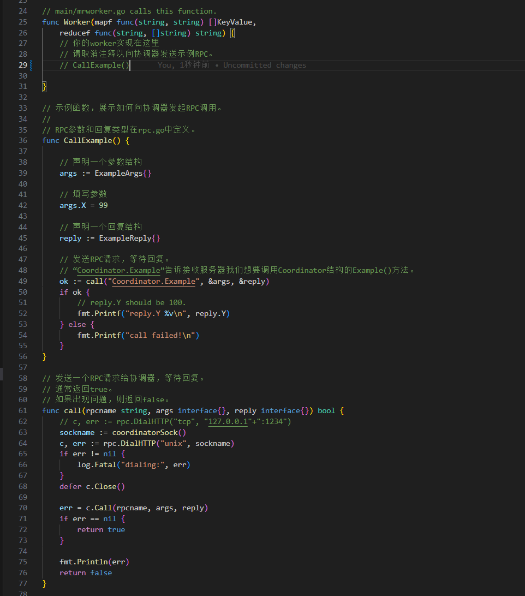

# Mit_6.824_lab1-MapReduce

> 6.824课程代号好像改成了6.5840，但是我们还是习惯叫它6.824

> [lab-link](https://pdos.csail.mit.edu/6.824/labs/lab-mr.html)

## 运行demo

通过阅读`lab`，我们发现，在源代码中已经为我们实现了一个词频统计的程序

从官网下载lab的代码架构，我们可以先运行一下词频统计的测试`demo`

```git
git clone git://g.csail.mit.edu/6.5840-golabs-2024 6.5840

cd ~/6.5840
cd src/main
go build -buildmode=plugin ../mrapps/wc.go
rm mr-out*
go run mrsequential.go wc.so pg*.txt
```

`-buildmode=plugin`是`go`语言编译器的一个参数，用于构建`go`插件（在程序中可以动态加载的代码模块）。当我们需要使用的时候，通过`plugin.Open("*.so")`与`Lookup("函数名")`就好了。


## 源码架构

我们要用到的框架，大体上分为两个部分模块，一部分是`worker`，另一个部分则是`coordinator`

### worker


在`worker`的入口地方会从前面提到的`go`插件中获取到`Map`和`Reduce`函数，并将这个函数作为参数传入的`Worker`中，而在`Worker`方法中实现对应的`RPC`逻辑



我们可以看到，在`Worker`中我们完成的是`RPC`相关的逻辑，代码中也给出一个实例，用来测试简单的`RPC`过程，我们可以看到`49`行是我们需要进行`RPC`请求的具体函数方法，而`Example`方法则是我们下面会讲到的`coordinator`中需要进行调用的过程。同样，`63-64`行我们可以看出来，我们的`RPC`远程过程也同样依赖于`socket`连接简历和`http`传输层的协议。通过`Call`方法就可以完成调用。

### coordinator


在`coordinator`的入口调用的就是一个`MakeCoordinator`的方法。这个方法主要是实现了对于`rpc`的注册，以及监听需要进行调用的服务。


我们的`Example`方法就是前面`worker`中的测例里中绑定的方法。实现的是对传入的参数`reply`中的`Y`进行一个计算，`reply.Y`则是我们测例中接收结果的参数。

### 测试RPC接口

我们取消`worker`中的注释以后，便可以进行测试。在一个终端中启动`coordinator`，后面的参数是本次任务中需要完成词频统计的文件名。

```bash
rm mr-out*
go run mrcoordinator.go pg*.txt
```


启动完以后，我们会发现，服务器开始进行等待了

在另一个终端中启动`worker`

```bash
go build -buildmode=plugin ../mrapps/wc.go
go run mrworker.go wc.so 
```


可以发现我们正常打印了`Y`的值，说明我们的`worker`调用`coordinator`中的方法成功。`RPC`可以用作少量的数据传输，在本次实验中也是作为我们不同节点之间的一种适用的通信协议。

通过测例的分析，我们可以很容易的推导出接下来完成实验的思路，目前大致的思路便是，通过

