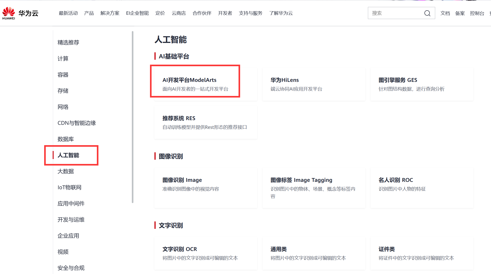
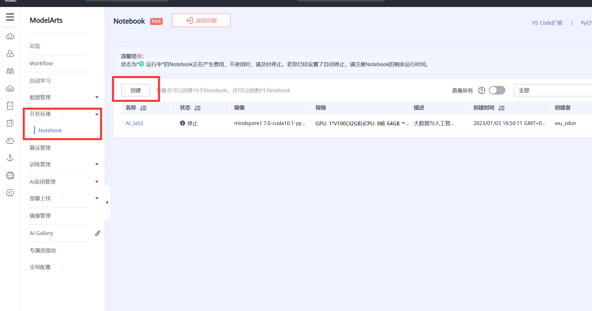
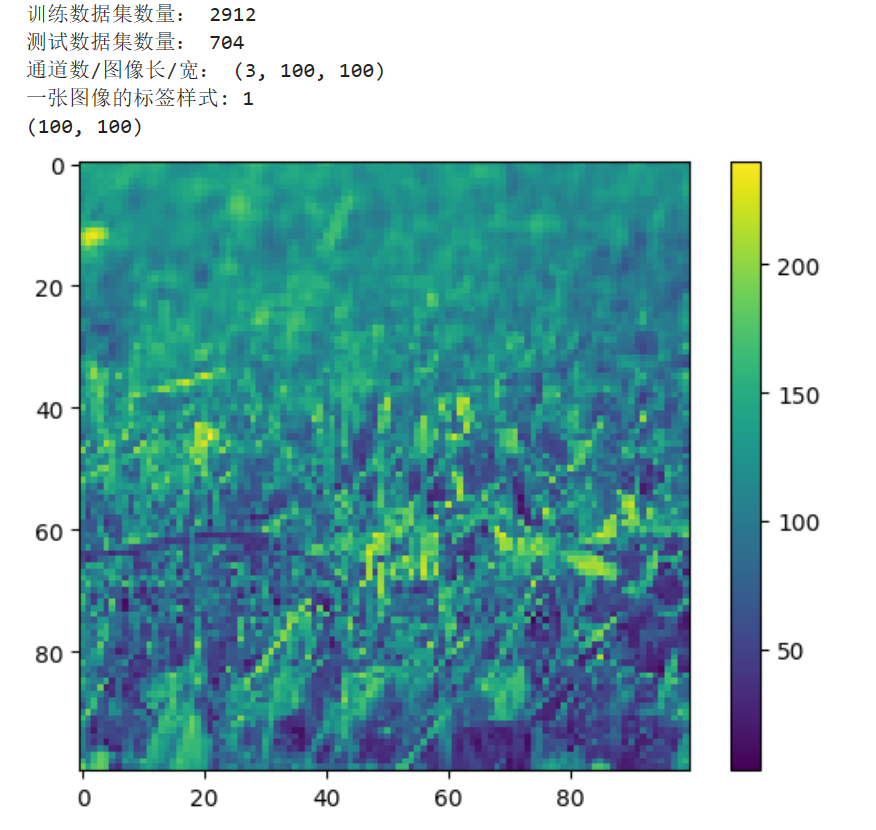
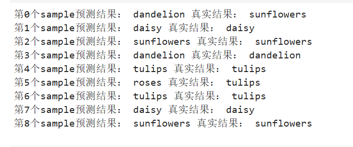

## 实验二、花卉图像分类实验

### 一、实验目的

> 1、掌握如何使用MindSpore进行卷积神经网络的开发
>
> 2、了解如何使用MindSpore进行花卉图片分类任务的训练
>
> 3、了解如何使用MindSpore进行花卉图片分类任务的测试

### 二、实验步骤

* **华为云环境的配置**

  > 使用ModelArts，并建立Notebook

  * 进入ModelArts

  

  * 点击管理控制台

  

  * 创建Notebook

  

  * 本次实验选择的是以下配置

  > mindspore1.7.0-cuda10.1-py3.7-ubuntu18.04
  >
  > GPU: 1*V100(32GB)|CPU: 8核 64GB
  >
  > 在华为的GPU上运行

  

  * 创建过后便可从列表中进行相关操作

  

* **实验步骤**

  * 导入相关函数

  ```python
  from easydict import EasyDict as edict
  import glob
  import os
  import numpy as np
  import matplotlib.pyplot as plt
  import mindspore
  import mindspore.dataset as ds
  import mindspore.dataset.vision.c_transforms as CV
  import mindspore.dataset.transforms.c_transforms as C
  from mindspore.common import dtype as mstype
  from mindspore import nn
  from mindspore.common.initializer import TruncatedNormal
  from mindspore import context
  from mindspore.train import Model
  from mindspore.train.callback import ModelCheckpoint, CheckpointConfig, LossMonitor, TimeMonitor
  from mindspore.train.serialization import load_checkpoint, load_param_into_net
  from mindspore import Tensor、
  
  # 设置Mindspore的执行模式和设备
  context.set_context(mode=context.GRAPH_MODE, device_target="GPU")
  ```
  
  * 定义实验中使用的变量
  
  ```python
  cfg = edict({
      'data_path':'flower_photos',
      'data_size':3670,
      'image_width':100,
      'image_height':100,
      'batch_size':32,
      'channel':3,
      'num_class':5,
      'weight_decay':0.01,
      'lr':0.0001,
      'dropout_radio':0.5,
      'epoch_size':400,
      'sigma':0.01,
      
      'save_checkpoint_steps':1,
      'keep_checkpoint_max':1,
      'output_directory':'./',
      'output_prefix':"checkpoint_classification"
  })
  ```
  
  * 下载并解压数据
  
  > 数据来源于qq群提供的下载链接https://storage.googleapis.com/download.tensorflow.org/example_images/flower_photos.tgz
  
  ```python
  # 解压数据集，运行一次即可
  # !wget https://storage.googleapis.com/download.tensorflow.org/example_images/flower_photos.tgz
  # !tar -zxvf flower_photos.tgz
  ```
  
  * 数据处理
  
  > 包含数据预处理和训练集和测试集的划分
  
  ```python
  de_dataset = ds.ImageFolderDataset(cfg.data_path,
                                     class_indexing={'daisy':0,'dandelion':1,'roses':2,'sunflowers':3,'tulips':4})
  
  transform_img = CV.RandomCropDecodeResize([cfg.image_width,cfg.image_height],scale=(0.08,1.0),ratio=(0.75,1.333))
  
  hwc2chw_op = CV.HWC2CHW()
  
  type_cast_op = C.TypeCast(mstype.float32)
  
  de_dataset = de_dataset.map(input_columns='image', num_parallel_workers=8, operations=transform_img)
  de_dataset = de_dataset.map(input_columns='image', num_parallel_workers=8, operations=hwc2chw_op)
  de_dataset = de_dataset.map(input_columns='image', num_parallel_workers=8, operations=type_cast_op)
  de_dataset = de_dataset.shuffle(buffer_size=cfg.data_size)
  
  # 划分训练集和测试集
  (de_train, de_test) = de_dataset.split([0.8,0.2])
  de_train = de_train.batch(cfg.batch_size, drop_remainder=True)
  
  de_test = de_test.batch(cfg.batch_size, drop_remainder=True)
  print('训练数据集数量：', de_train.get_dataset_size()*cfg.batch_size)
  print('测试数据集数量：', de_test.get_dataset_size()*cfg.batch_size)
  
  data_next = de_dataset.create_dict_iterator(output_numpy=True).__next__()
  print('通道数/图像长/宽：', data_next['image'].shape)
  print('一张图像的标签样式:', data_next['label'])
  print(data_next['image'][0,...].shape)
  
  plt.figure()
  plt.imshow(data_next['image'][1,...])
  plt.colorbar()
  plt.grid(False)
  plt.show()
  ```
  
  
  
  * 定义CNN图像识别网络
  
  > 定义的网络包含4个卷积层，4个池化层，2个全连接层
  
  ```python
  class Identification_Net(nn.Cell):
      def __init__(self, num_class=5, channel=3, dropout_ratio=0.5, trun_sigma=0.01):
          super(Identification_Net, self).__init__()
          self.num_class = num_class
          self.channel = channel
          self.dropout_ratio = dropout_ratio
          # 卷积层
          self.conv1 = nn.Conv2d(self.channel, 32,
                                 kernel_size=5, stride=1, padding=0,
                                 has_bias=True, pad_mode='same',
                                 weight_init=TruncatedNormal(sigma=trun_sigma), bias_init='zeros')
          
          # 设置Relu激活函数
          self.relu = nn.ReLU()
          
          # 设置最大池化层
          self.max_pool2d = nn.MaxPool2d(kernel_size=2, stride=2, pad_mode='valid')
          self.conv2 = nn.Conv2d(32, 64,
                                 kernel_size=5, stride=1, padding=0,
                                 has_bias=True, pad_mode='same',
                                 weight_init=TruncatedNormal(sigma=trun_sigma), bias_init='zeros')
          self.conv3 = nn.Conv2d(64, 128,
                                 kernel_size=3, stride=1, padding=0,
                                 has_bias=True, pad_mode='same',
                                 weight_init=TruncatedNormal(sigma=trun_sigma), bias_init='zeros')
          self.conv4 = nn.Conv2d(128, 128,
                                 kernel_size=5, stride=1, padding=0,
                                 has_bias=True, pad_mode='same',
                                 weight_init=TruncatedNormal(sigma=trun_sigma), bias_init='zeros')
          
          self.flatten = nn.Flatten()
          self.fc1 = nn.Dense(6*6*128, 1024, weight_init=TruncatedNormal(sigma=trun_sigma),bias_init=0.1)
          self.dropout = nn.Dropout(self.dropout_ratio)
          self.fc2 = nn.Dense(1024, 512, weight_init=TruncatedNormal(sigma=trun_sigma),bias_init=0.1)
          self.fc3= nn.Dense(512, self.num_class, weight_init=TruncatedNormal(sigma=trun_sigma),bias_init=0.1)
          
      # 构建模型
      def construct(self, x):
          x = self.conv1(x)
          x = self.relu(x)
          x = self.max_pool2d(x)
          x = self.conv2(x)
          x = self.relu(x)
          x = self.max_pool2d(x)
          x = self.conv3(x)
          x = self.max_pool2d(x)
          x = self.conv4(x)
          x = self.max_pool2d(x)
          x = self.flatten(x)
          x = self.fc1(x)
          x = self.relu(x)
          x = self.dropout(x)
          x = self.fc2(x)
          x = self.relu(x)
          x = self.dropout(x)
          x = self.fc3(x)
          return x
  ```
  
  * 模型训练和预测
  
  > 使用交叉熵损失函数，epoch_size为400，batch_size为32，学习率为0.0001，sigma为0.01
  
  ```python
  net = Identification_Net(num_class=cfg.num_class, channel=cfg.channel, dropout_ratio=cfg.dropout_radio)
  
  net_loss = nn.SoftmaxCrossEntropyWithLogits(sparse=True, reduction="mean")
  
  fc_weghit_params = list(filter(lambda x:'fc' in x.name and 'weight' in x.name, net.trainable_params()))
  other_params=list(filter(lambda x:'fc' not in x.name or 'weight' not in x.name, net.trainable_params()))
  
  group_params = [{'params':fc_weghit_params, 'weight_decay':cfg.weight_decay},
                  {'params':other_params},
                  {'order_params':net.trainable_params()}]
  
  net_opt = nn.Adam(group_params, learning_rate=cfg.lr, weight_decay=0.0)
  
  model = Model(net, loss_fn=net_loss, optimizer=net_opt, metrics={'acc'})
  
  loss_cb = LossMonitor(per_print_times=de_train.get_dataset_size()*10)
  config_ck = CheckpointConfig(save_checkpoint_steps=cfg.save_checkpoint_steps,
                               keep_checkpoint_max=cfg.keep_checkpoint_max)
  ckpoint_cb = ModelCheckpoint(prefix=cfg.output_prefix, directory=cfg.output_directory, config= config_ck)
  print("=================开始训练==================")
  
  model.train(cfg.epoch_size, de_train, callbacks=[loss_cb, ckpoint_cb], dataset_sink_mode=True)
  
  # 使用测试集评估模型，打印总体准确率
  metric = model.eval(de_test)
  print(metric)
  ```
  
  > 总体准确率为0.9432
  
  
  
  * 对具体样本进行预测
  
  ```python
  import os
  CKPT = os.path.join(cfg.output_directory, cfg.output_prefix+
                      '-'+str(cfg.epoch_size)+'_'+str(de_train.get_dataset_size())+'.ckpt')
  
  net = Identification_Net(num_class=cfg.num_class,channel=cfg.channel,dropout_ratio=cfg.dropout_radio)
  
  load_checkpoint(CKPT, net=net)
  
  model = Model(net)
  
  class_names = {0:'daisy', 1:'dandelion', 2:'roses', 3:'sunflowers', 4:'tulips'}
  test_ = de_test.create_dict_iterator().__next__()
  
  test = Tensor(test_['image'], mindspore.float32)
  
  predictions = model.predict(test)
  predictions = predictions.asnumpy()
  true_label = test_['label'].asnumpy()
  
  for i in range(9):
      p_np = predictions[i, :]
      pre_label = np.argmax(p_np)
      print('第' + str(i) + '个sample预测结果：', class_names[pre_label], '真实结果：', class_names[true_label[i]])
  ```
  
  
  
  * 模型保存
  
  

#### 三、总结

​		实验利用华为云平台完成了对于花卉分类实验，首先第一方面，对华为云平台以及华为开发的MindSpore深度学习框架有了进一步的了解。在华为云平台上可以为我们提供一些项目开发平台，具有一套完整的开发体系，如：OBS用于存储对象，ModelArts用于AI开发，训练模型等等。能够提供一些相对来说比较适宜的计算机算力，华为的GPU以及Ascend都可以通过云开发平台很好的运用。同时，对于MindSpore来说，和Tensorflow，Pytorch这一类框架一样，都是以Tensor张量做为数据基础，通过MindSpore能够很好的搭建相关网络，完成训练，梯度下降，等等运算。

​		本次实验解决的是花卉分类问题，是一个多分类的问题，对于多分类的问题了解更为深刻，多分类问题和二分类问题不一样的是，多分类问题会使用交叉熵损失函数，并在输出之前使用softmax函数进行处理，目的是将预测值映射为一个概率值，对比概率值最大的即作为最后的输出结果。同时对于卷积层，池化层，全连接层，这一些在图像处理当中常用到的网络加深了理解，通俗来讲，卷积层目的在于特征提取，池化层的目的在于优化参数，全连接层的目的则是特征整合。而在完成深度学习的过程中，重要的一点还有参数的设置，参数的设置，对于训练时长，训练效果也有较大的影响。

#### 四、实验中遇到的一些问题

* 应该选择Relu函数还是Sigmoid函数？

  解决方案：本次实验使用的时Relu函数做为激活函数，相对于Sigmoid来说，Relu函数不存在梯度消失的问题，能够尽可能多的进行迭代，降低损失值。

#### 五、实验验收过程中问到的相关问题

* 问题1：该实验解决的是一个什么问题？设计的网络输出的向量是一个几维的？

  回答：本次实验解决的是一个多分类问题，再具体来说，是一个五分类问题，完成的是识别给出的图片属于已知五类花卉中的哪一种，因此输出的向量是5维的。

* 问题2：该实验使用的是什么损失函数？

  回答：使用的是交叉熵损失函数，在交叉熵前面会有一个softmax处理，softmax的处理过程就是将输入的数据映射到（0，1）之间的范围当中，并且使得输出的所有值累加和为1，从某种意义上来说，这也是相当于一种概率。
