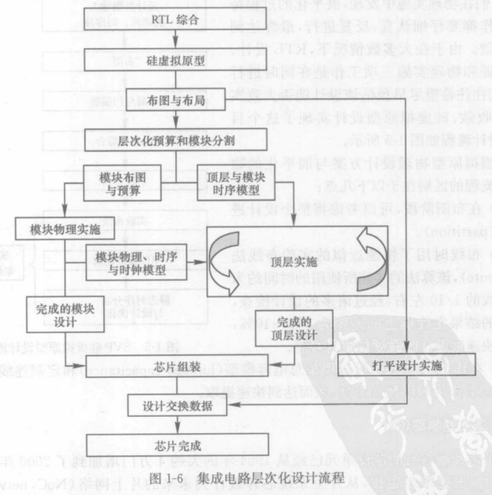
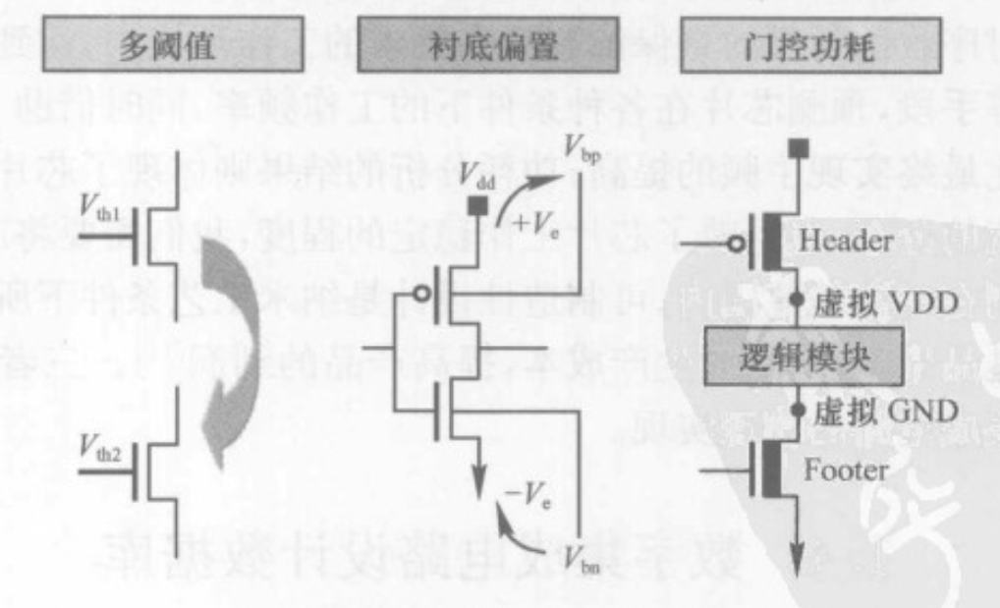
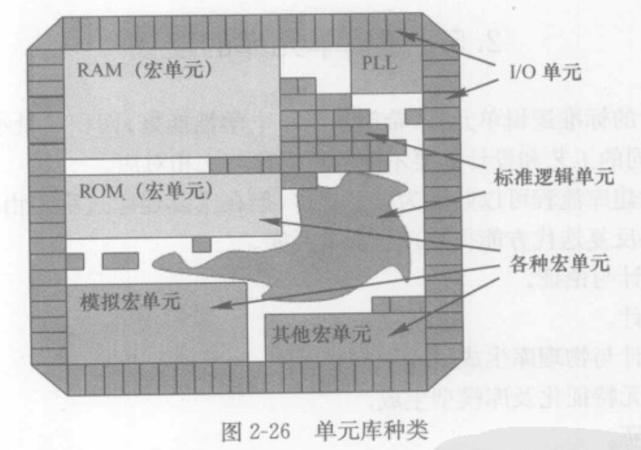
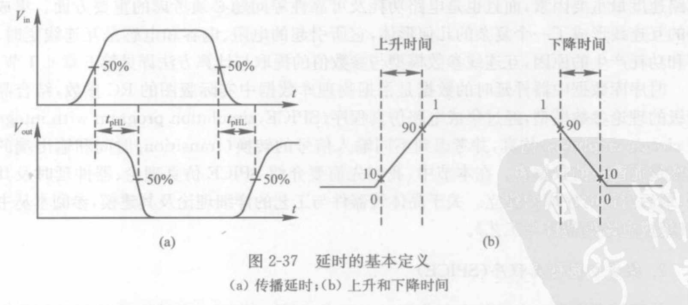
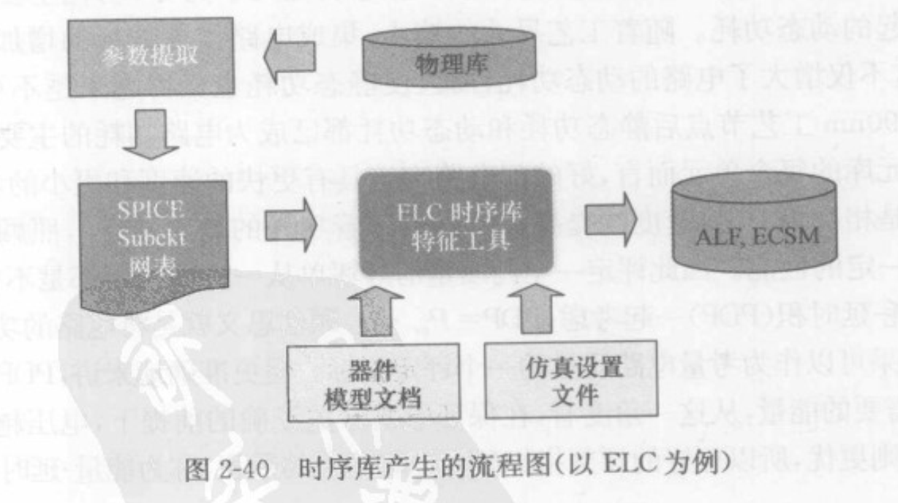
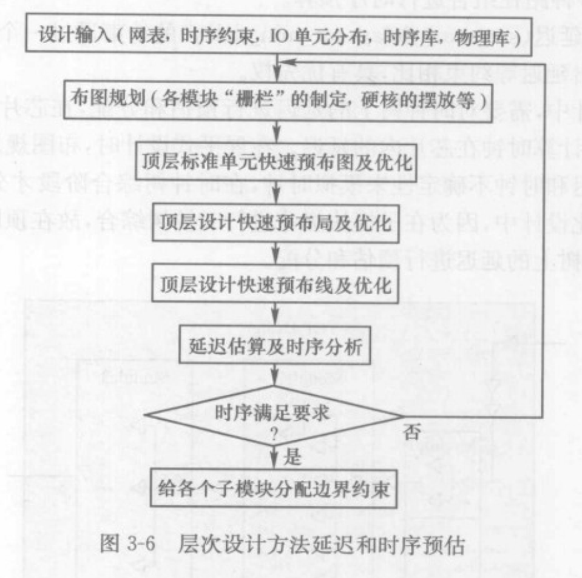
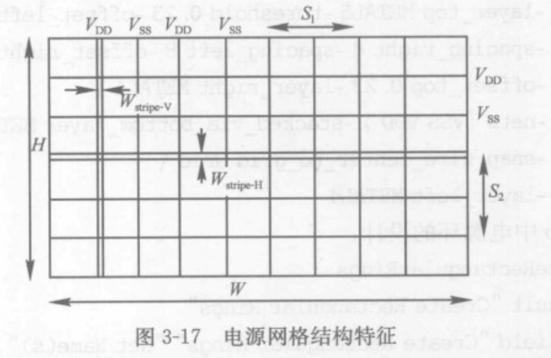
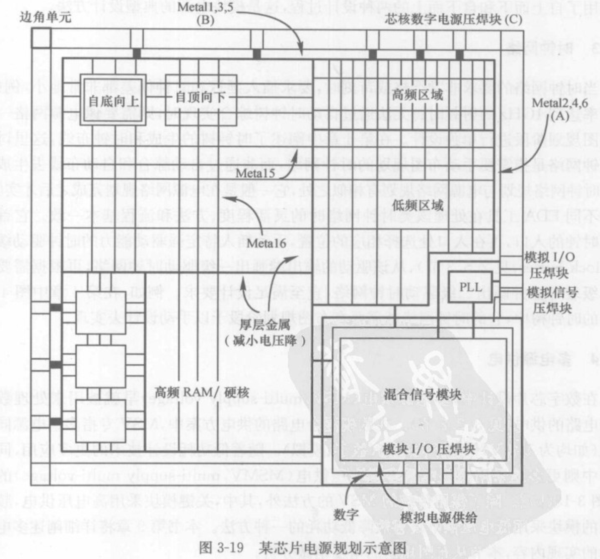
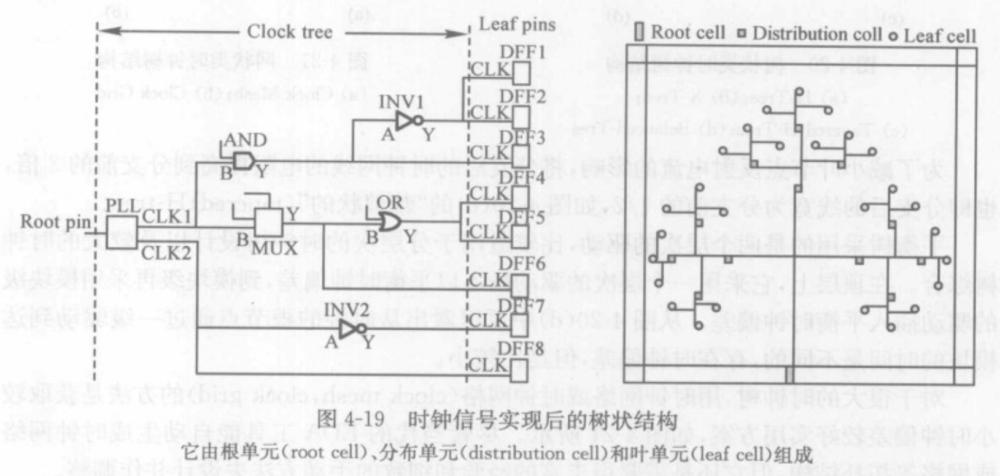
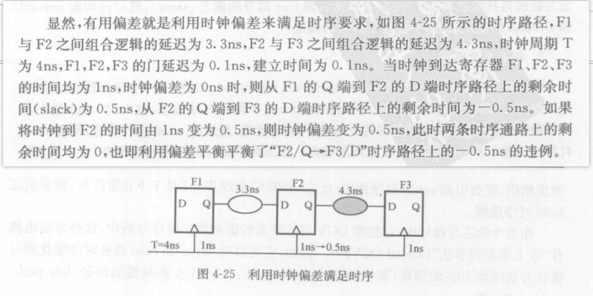

## 第一章、集成电路物理设计方法

### 数字集成电路设计流程

三个I年代，发明，实施和整合

Innovation：布局布线的基本算法、时序分析和逻辑综合的发明

Implementation：开始于FPGA中门阵列的实现，ASIC设计中同等高度标准逻辑单元库的设计

Integration：模块化

**芯片的物理实施重点解决的问题**

对于深亚微米芯片

* 解决时序驱动设计

* 防止工艺天线效应
* 进行信号完整性分析

对于纳米的设计，需要多考虑的问题

* 功耗分析和低功耗设计，并要统一考虑它的功能验证，逻辑综合和形式验证
* 实施纳米设计中的光学近似检查（OPC）和移相掩膜（PSM），增加设计产额和可制造性设计
* 统计静态时序分析，多端角分析

**展平式物理设计**

> 标准逻辑门单元库的简历。采用自下向上的方法，设计晶体管-仿真-建立版图-对逻辑门单元仿真建模


**硅虚拟原型设计**


与展平化的物理设计流程区别

* 布图阶段，考虑将整个设计进行分割
* 布线时用了快速近似的试验布线法
* 在做RC提取时，可以用集总电容模型

**层次化物理设计**

> 芯片设计的最终检查标准之一为是否实现了时序收敛

自上而下的层次化物理设计：将设计分为数个分割块，对每个分割块进行展品化处理（独立的布局布线），在顶层完成组装设计



优点：将很大的设计化成多个小设计，如果有时序问题可能存在于个别模块，再去重点解决，降低了复杂性。

* 基于设计驱动时序图

  在顶层设计和模块设计之间建立一个连接的时序图桥梁，从而避免当模块设计完成后回到顶层无法收敛而造成大量的设计迭代。

  将模块级的实施分成多个阶段，如时钟树综合，详细布线阶段，布线优化阶段

### 数字集成电路设计收敛

> 设计时序收敛任务通过三大部分工作来完成：数据系统，优化引擎，分析引擎
>
> 数据系统：由读取、处理和存储
>
> 优化引擎：基于算法去实现逻辑优化，布局优化，和布线优化
>
> 分析引擎：由设计工程师借助EDA工具用于时序分析，功耗分析和噪声分析的EDA工具

**时序收敛**

静态时序分析最重要任务：寻找最长延时路径以及最坏情况下的延时

总延时：由逻辑门延时和互连线延时组成

静态时序路径：组合逻辑电路，时序逻辑电路形成的路径

**功耗分析**

* 静态功耗分析

  使用时序库提供的器件功耗可以计算

* 动态功耗分析

  需要提供设计仿真的数据

降低功耗的方式：多电源电压方法、门控电路方法、衬底电压偏执方法



### 习题：

* 1、讨论什么是数字电路的物理设计和物理实施？

  集成电路的物理实施方法被概括为从RTL综合到最终完成GDSII数据的实现，RTL一种硬件描述语言，用于描述数字电路的逻辑功能和寄存器传输级别的行为。GDSII是一种电子设计自动化工具所使用的标准格式，用于描述芯片的物理布局和制造信息。

  将RTL转换为GDSII是一个多步骤的过程，通常包括以下几个主要阶段：

  * 1、逻辑综合：将RTL描述的电路转换为门级电路，生成门级网表。
  * 2、时序优化：对门级网表进行优化，以减少电路的面积、功耗或者时钟延迟等。
  * 3、布局：根据门级网表生成芯片的物理布局，包括各个组件的位置、尺寸和连线等。
  * 4、布线：根据布局信息进行连线，确保电路的信号可以正确传输。
  * 5、物理验证：对布局和布线结果进行物理验证，包括规则检查、电气特性分析等。
    * 后面有一个提取阶段
  * 6、转换为GDSII：将经过物理验证的布局和布线结果转化为GDSII格式，生成最终的物理设计数据

* 2、什么是硅虚拟原型SVP？为什么要提出硅虚拟模型设计方法？

  硅虚拟原型：是一种基于软件仿真和硬件加速的技术，用于验证和评估芯片设计的功能和新能。

  采用硅虚拟模型设计方法能够尽早预估该设计能否大致实现时序收敛，具有更快的设计迭代速度和更低的开发成本。

* 3、展平式物理设计与层次式物理设计的共同点和不同点是什么？

  基本流程都具备，但是步骤顺序可能存在偏差

  展平式设计是一种自下而上的模块化方法，从底层器件再到版图

  层次化设计是一种自上而下的物理设计方法，从版图再往下

* 4、设计收敛的实现与设计流程有关吗？

  有关，设计流程可以提供一种系统化的方法和框架，能够有效地引导和管理设计的各个阶段，以实现设计收敛，使得设计能够按照预期目标收敛。

* 5、当今EDA工具的设计所采用的主要的数据文件格式有哪些？数据库格式有哪些？常用的编程语言有哪些？

  RTL：硬件描述语言编写的RTL代码

  网表：描述芯片的逻辑电路结构和连接关系的文本文件

  GDSII：用于描述芯片的物理布局和制造信息的二进制格式

  LEF和DEF：用于描述芯片的物理布局和制造信息的二进制格式

  SDC：用于定义时序约束的文本文件，指定电路的时序要求和约束条件

## 第二章、物理设计建库与验证

### 集成电路工艺与版图

**CMOS工艺流程**

晶圆—形成制造晶体管所需的衬底和阱区—形成晶体管栅层图形—形成源漏、衬底和阱接触等其它有源区—通过接触孔将需要连接的地方与第一层金属互连—进行其它几层金属互连—添加钝化层与外界隔离开

**工艺技术文件**

> 晶体代工厂提供给设计者用于后端版图设计的技术文件，用于与EDA工具交互工艺信息，内容包括图形定义及显示信息，互连线工艺信息和通孔工艺信息

### 设计规则检查（DRC）

主要目的：检查版图中所有因违反设计规则而引起潜在断路，短路或不良效应的物理验证过程

**版图设计规则**

> 晶圆代工厂对不同工艺参数制定出满足芯片制造良率的同一工艺层以及不同工艺层之间几何尺寸的最小值，这些最小值规划的集合就是版图设计规则。

* 逻辑运算
  * AND操作
  * OR操作
  * NOT操作，双目运算，A NOT B属于A，但不属于B的部分
* 拓扑运算
  * 重叠
  * 包含
  * 相切
* 集合运算
  * 面积
  * 周长
  * 间距

### 电路规则检查

> 1、所有信号的电气连接关系是否一致
>
> 2、器件类型尺寸是否一致
>
> LVS文件：期间提前规则、电路比较规则、器件捆绑规则

**电路提取与比较**

步骤：更具LVS提取规则，从版图中抽取出版图所需要的网表文件。将抽取出的网表文件与电路网表文件做对比。

**器件类型和数目及尺寸检查**

* 器件类型检查：电阻、电容、电感、双极晶体管、MOS管、二极管
  * 通过从版图与原理图中寻找名称相一致的器件实现
* 器件数目与尺寸检查
  * 检查版图中对应节点上期间的数量以及每个器件的尺寸是否与原理图中对应结点的期间数量与尺寸一致

**LVS在数字IC中的检查**

常用的解决LVS错误的方法

* 检查器件数目
* 检查器件类型
* 检查节点数量
* 检查电源线和地线的连接
* 从关键点找起

### **版图寄生参数提取与设计仿真**

**版图寄生参数提取**

版图设计的完整寄生参数应当包括R（电阻）、C（电容）、L（电感）、K（互感）

LPE（版图寄生参数提取）/PRE（寄生电阻提取）提取的主要参数包括MOS管源漏的周长、面积、电阻，沟道的长与宽，双极晶体管和二极管的结面积、结周长，以及结点寄生电容、互连线电容电阻、接触孔电阻等。

**版图设计仿真**

使用牛顿迭代法，用泰勒级数的前几项来寻找方程f(x)=0的根

### 逻辑单元库的建立

> 逻辑单元的建库流程归纳为以下5步
>
> 1、方案设计与论证
>
> 2、电路设计
>
> 3、版图设计与物流库生成
>
> 4、标准单元特性及库模型生成
>
> 5、设计验证

**逻辑单元类别**

完整的单元库根据在芯片中的应用可以分为三类

* 标准单元(standard cell)

  放置于芯片的核心区起逻辑功能粘接作用

* 模块宏单元(macro block)

  放置于芯片核心区，至少包括嵌入式存储器（RAM和ROM）、IP、COT模块

  其它重要的宏单元模块：始终PLL模块，DSP模块

* 输入输出单元(I/O pad cell)

  放置于核区的周围，用于芯片信号的输入、输出和电源供给



**逻辑单元电路**

组合逻辑电路简称为组合电路包括

* 反向逻辑电路：反向器、与非门、或非门
* 非反向逻辑电路：缓冲器、与门、或门
* 其它常用逻辑电路：数据选择门（MUX）、异或门、数据传输门（TBUF）、复合门（AOI）
* 特殊功能的逻辑电路：加法器、乘法器、除法器

时序逻辑电路也称为时序电路

> 输出信号不但同但钱的输入相关还和上一时间的输出有关，具有记忆功能

包括：

* 锁存器（Latch）：专指电平敏感的时序电路
* 寄存器类（flip flop）：时钟边沿出发

**模块单元（宏单元模块）**

存储单元ROM：NOR ROM、NAND ROM、EPROM、EEPROM、FAMOS ROM

存储单元RAM：静态随机存储器SRAM、动态随机存储器DRAM

专用模块：客户自由工具COT，专用标准产品ASSP，信号处理器DSP

黑盒子商业IP模块：电路设计不公开

模拟电路模块：时钟锁相环PLL模块

**输入输出单元**

> 包括输入信号、输出信号、三态门、双向、电源和接地单元

对于输入单元要考虑静电放电的防护

形成电阻的方法：n型扩散层、p型扩散层和多晶硅

形成电容的方法：Poly、Mos栅电容

**物理单元库与数据文件，LEF文件**


标准单元建库的规则

* 所有单元都等高的矩形，或者是基本高度的整数倍
* 所有版图都用预先定义的模板进行设计
* 所有单元的端口位置、大小、形状都尽量满足网格间距的要求
* 电源线和地线一般位于单元的上下边界

模块单元建库

* 先建立RAM和ROM的基本单元
* 根据比特和字长，自底向上堆砌生成版图

I/O单元

* IO拐角单元在芯LEF文档的单元类型中被定义为Endcap，分布在拐角处

**时序单元建库与数据文件**

器件延时：表示信号通过一个逻辑门时所经历的时间，反映了门对输入信号变化响应的快慢。通过输入信号电压变化的50%到输出信号电压变化的50%所需要的时间来定义门延时的大小。



用于DSM设计的器件延时模型

* 开关线性RC模型
* 经验推导公式（K-Factor方程）
* 非线性延时模型
* 可伸缩多项式模型

时序库文件



EDA工具通常采用两种模型计算天线比率，一种时部分检查模型，另一种是积累检查模型

### 习题：

* 1、什么是标准单元库？它主要包括哪几类单元？它们分别在电路中起什么作用？

  标准单元库是一种预先设计和验证的模块化的芯片单元集合，用于构建数字集成电路，包含了经过验证和优化的标准逻辑门和寄存器等基本单元，可以在芯片设计中重复使用，以节省设计时间和提高设计的可靠性。

  主要包括：逻辑门、寄存器、编码解码器、算术逻辑单元、存储器单元

  使用标准单元库可以提高设计的效率，降低设计风险，促进可重用性。

* 2、标准单元有几种不同抽象级别的描述？为什么要采用不同抽象层描述同一电路单元？

  逻辑级描述、电路级描述、物理级描述

  采用不同抽象层描述同一电路单元可以更好的管理设计的不同方面，优化设计的性能和可靠性，并在设计复杂性和效率之间进行权衡。

* 3、解释LEF库文件在物理实施布局布线中的作用和重要性，并说明它所定义的内容是如何知道EDA工具实现自动布局布线的。

  LEF库文件定义了标准单元的物理特性，包括尺寸大小方向以及引脚位置和功能等等

  EDA工具实现自动布局布线是通过读取和解析LEF库文件中的信息。工具可以根据LEF文件中定义的物理特性和约束，生成优化芯片的物理布局和连线。

## 第三章、布图规划（芯片规划）和布局

### 布图规划

布图规划开始时，首先要准备好各种基本设计数据和相应的物理库、时序库文件，并输入到不图规划的工具环境中来


布图规划主要内容包含对芯片大小的规划、芯片设计输入输出单元的规划、大量硬核或模块的规划

**布图规划的主要目标**

* 确定芯片的面积
* 确保时序的收敛
* 保证芯片的稳定
* 满足布线的要求：保证布线通畅的同时，尽量缩短走线的长度

**I/O接口单元的放置与供电**

放置方式：1、pin点方式，2、pad条状方式，3、做成固定模块，将pad集成

当芯片面积较大，芯片时序较为紧张时，I/O单元也可能均匀分布在芯片的内部


I/O单元的供电：I/O单元分为信号接口和电源两种

电源I/O单元分为3类：给模拟器件供电的I/O单元、给数字期间供电的、用于隔离数字供电和模拟供电

数字I/O也分为两大组：一组是给I/O单元供电，一组是给核内的标准单元供电

给I/O单元供电的供电单元数量由多种因素决定：I/O单元的消耗、输出I/O单元的驱动能力、同步开关噪声

**布图规划方案与延迟预估**

展平化设计

因为还没有进入布线阶段，使用线负载模型预估当前布局的时序，展平式的方法会占用大量的内存，需要很长的运行时间。

层次化设计

> 思想是将大规模的顶层设计分解成多个子模块，每个子模块并行完成布局布线，最后在顶层组装。
>
> 大致分为三个步骤：芯片顶层设计规划、子模块分割与实现、芯片顶层组装时序

在层次化设计的过程中，需要在布图和布局规划中对时钟进行预估，流程图如下：

> 根据子模块大小，和子模块中的元件数量以及复杂度来进行预估



**模块布放与布线通道**

布线轨道：芯片内部专门用于布线的路径

布线通道：每两条或多条布线轨道的空间，上面不可以摆放标准单元

### 电源规划

> 给整个芯片的供电设计出一个均匀的网络，电源规划在芯片布图规划后或在布图规划过程中交叉完成。
>
> 电源网络设置、数字模拟混合供电、单电源与多电源供电电压网络设置

芯片供电是通过I/O单元来实现的，需要先完成电源预算，

**电源网络设计**

* 电源连接关系定义global net connect
* 芯片核内部分的电源环设计power ring
* 芯片内所包含的硬核（如 RAM、ROM以及IP、COT模块）的电源环设计
* 芯片核内纵横交错的电源网络设计
* 芯片的供电单元与电源环的连接
* 芯片内部的电源网络与硬核电源环连接部分的设计
* 将标准单元的供电网络和硬核电源环连接部分的设计
* I/O供电单元电源环的设计

1、全局电源

电源的定义主要包括：全局电源的定义以及连接关系的定义。

* 电源和接地网络：通过wire定义
* 接高电压和接低电压网络
* 电压和接地端口
* 填充单元网络

2、电源环线

为了能够均匀供电，包围在标准单元周围的环形供电金属，是连接供电I/O单元和标准单元的桥梁

电源网格可以平均分布电流，缩短电流回路，在有效减少电压降的同时，避免由于电流分布不均时造成的热点现象以及电迁移问题。

3、电源条线

芯片内部纵横交错的电源网格和电源条线设计有专门的理论和算法。



纵向必须用偶数层走线，横向必须用奇数层走线。

**数字与模拟混合供电**

1、模拟模块的工作区域一般放置于芯片的某个角落

2、模拟区域需要单独供电

3、在模拟模块的周围布置保护隔离环，从而实现数字信号和模拟信号电源之间的隔离



**多电源供电**（麻了，看不懂）

### 布局

> 因为此时以及将芯片的各个部分规划好了，需要在具体规划的区域中填充详细的模块

**展平式布局**

模块的摆放与布局

标准单元的摆放和优化

简单来说：放置模块和标准单元·

**层次化布局**

> 先分配子模块、作子模块的布局、所有子模块完成后在顶层组装

* 约束类型确定

  > 约束类型一般有三种：向导约束、区域约束和限制约束

* 子模块大小位置的制定

**布局目标预估**

> 在标准单元布局优化完成后，需要对设计进行拥塞分析，静态时序分析，噪声分析，和电源分析以确定布局的好坏

布局的目标

* 各模块的位置相对确定
* 满足设计规则的要求
* 芯片的时序和供电较为良好

**标准单元布局优化算法**

> 布局优化的算法从步骤上可以分成三个阶段：结群布局、全局布局、详细布局

1、布局优化的算法

* 结群算法（clustering聚类算法）

  选择一个单元作为种子，以各个种子为原始群不断结合与其最紧密的单元。

* 模拟退火算法、KL算法、FM算法

* 全局布局：最小切割法、模拟退火算法、贪心算法、力向量算法、NRG算法、HALO算法

* 布局优化算法：纯标准单元布局算法、模块布局算法、混合单元布局算法

2、从优化目标上优化算法

* 基于布线拥塞的布局优化算法
* 基于时序的布局算法
* 预防噪声的布局算法

### 扫描链重组

> 扫描链是可测试性设计的重要内容，将芯片中所应用的普通寄存器替换成带扫描功能的多输入输出扫描寄存器，首位连接成串，从而实现附加的测试功能。

将连接在扫描链上的在芯片内随机分布的扫描寄存器单元按照其物理位置，在不影响逻辑功能的前提下，重写进行连接，从而减少扫描链的走线长度。

实现方法：

* 本地化重组
* 基于扫描DEF的扫描链重组方法

### 物理设计网表文件

DEF(design exchange format)文件：设计交换给格式

PDEF(physical DEF)：物理设计交换格式

## 第四章时钟树综合CTS

### 时钟信号

**时钟信号抖动**：时钟抖动定义为信号时间与理想事件时间的偏差，抖动中含有确定抖动成分和随机抖动成分。

* 确定抖动：串扰、电磁干扰、同时开关输出引起
* 随即抖动：服从高斯分布，通常由半导体晶体结构的热振动和半导体掺杂密度不均匀中共价电子引起

### 时钟树综合的方法

> 芯片设计中的时钟分为两类：真实时钟（real clock）和虚拟时钟（virtual clock）
>
> 真实时钟又有两种模式：时钟树综合前没有延时的理想时钟，时钟树综合后的传播时钟

**时钟树综合与标准设计约束文件**：SDC文件（时序约束文件）

SDC文件三部分：时钟定义、输入延迟、输出延迟

通过工艺文件来约束时钟信号的相关属性

时钟的定义将通过时钟树综合来实现，时钟延迟和时钟抖动或不确定性将在静态时序分析时进行检查。

**时钟树结构**

```
时钟树：时钟信号在物理设计中的实现结果
根节点：时钟信号的起点
叶结点：时钟信号经过一系列分布结点最终到达寄存器时钟输入端或其它时钟终点
根单元、分布单元、叶单元：根节点、分布节点和叶结点都依附于的逻辑单元
```

时钟网络从根节点逐级插入驱动器，从而到达其叶结点，按照芯片始终网络的约束要求产生时钟树的过程叫做是中暑综合。



时钟树根据其在芯片内的分布特征，可分为多种结构：H树、 X树、平衡树、疏状或脊椎状时钟网

### 时钟树设计策略

**时钟树综合策略**

* 自我交叉
* 相互交叉时钟
* 有用偏差



* OVC片上误差分析法与CPPR共同路径悲观去除的应用

* 与布局相结合的手动时钟树设计
* 对时钟插入多驱动的buffer

**异步时钟树设计**

实际的SoC设计中，是以异步时钟设计来实现的，从而降低功耗


**门控时钟**

门控时钟是降低功耗最常用的方法，使用一个控制信号控制时钟的开启。

### 时钟树分析

**时钟树与功耗分析**

> 时钟树上的功耗由静态功耗、短路功耗和跳变功耗三部分组成

* 静态功耗：各个buffer上静态功耗和，减少静态功耗的方法就是减少buffer的加权数
* 短路功耗：与转换时间成正比，与阈值电压的3次方成反比
* 跳变功耗：占比50%以上，由门的加权数值以及互连线总的电容决定

降低功耗的方案

* 1、减小时钟信号转换时间，信号从10%转化到90%所需要的时间
* 2、降低结点电容

## 第五章、布线

> 将分布在芯片核内的模块、标准单元和输入输出接口单元按逻辑关系进行互联
>
> 要求百分百地完成它们之间的所有逻辑信号的互联，并为满足各种约束条件进行优化

### 全局布线

**全局布线目标**

* 1、使总连线最短
* 2、布线分散均匀不至于引起局部拥塞
* 3、使关键路径延时最小，遵守时序规则
* 4、理解信号完整性要求，避免串扰
* 5、保持将BUS总线聚集相连等

**全局布线规划**

### 详细布线

**详细布线的目标**

* 1、理解所有的设计规则
* 2、自动切换并综合利用多层金属作连线
* 3、遵守时序规则，优先使关键路径的延时满足要求
* 4、对总连线长度进行优化

**详细布线与设计规则**

* 设计规则
* 通孔和最小面积要求
* 密度要求
* 掩膜光刻过程中的工艺天线效应
* 串扰在布线中的预防和修复
* 纳米布线规则
* 对焦布线规则

**布线修正**

* 自动修正
* 渐进修正
* 局部修正

## 第六章、静态时序分析

> 做时序分析前，首先要对芯片的物理版图设计进行包括电阻、电感、电容参数的提取，在进行延时计算。

### 延迟计算与布线参数提取

**延迟计算模型**

> 可以在布局之后进行，也可以在时钟树综合后进行。使用WLM区估算

各种参数提取、各种物理公式：电阻电容电感

### 寄生参数与延迟格式文件

1、标准寄生参数格式文件

* SPF-Standard Parasistic Format（File），标准寄生参数格式文件
* DSPF-Detailed SPF，详细标准寄生参数格式文件
* RSPF-Reduced SPF，简化标准寄生参数格式文件
* SPEF-Standard Parasitic Exchange Format（File），标准寄生参数交换格式文件

### 静态时序分析

> 进行时序分析时，简单的说就是将某一段路径的时序与时序约束的要求进行比较。根本目的是为了检查在时钟的控制和要求的约束下，与其相关的数据能够符合时序要求被记录存储下来，这种时序检查就是一对常说的建立时间时序和保持时间时序。

Setup定义：在时钟作用前沿到达前，同步输入信号D必须保持稳定的那段时间以使信号不至于丢失。

Hold定义：在时钟作用前沿到达后，同步输入信号D必须保持稳定的那段时间以使得信号不至于丢失。

1、建立时序（Setup）的违例

要求同步输入数据D必须在时钟信号前的某个时段到达且不发射变化，这样数据才会被成功的锁存。

2、保存时序违例

增长数据的路径延迟

**时序分析与时钟特性**

* 定义输入输出环境参数
  * 1、确定驱动
  * 2、确定驱动单元
  * 3、确定负载
  * 4、确定删除

### 时序优化

**造成时序违例的因素**

* 1、系统设计的复杂性和抽象性，存在不合理的约束
* 2、逻辑综合时依据了不合理的WLM
* 3、设计太大，互连线的相互牵制引起时序违例
* 4、设计做了不合理的布局

### 习题

1、什么是静态时序分析？描述它的分析步骤过程。

* 静态时序分析是一种在设计和验证数字电路时用于评估电路时序特性的方法。主要用于分析电路中的时序路径，包括组合逻辑路径和时钟路径，以确保电路在给定的时钟频率下能够满足时序要求。是一种基于约束和路径分析的方法，用于评估电路的时序特性和性能。

2、什么是建立时间和保持时间？什么是虚假路径、多周期路径？

* 建立时间：在时钟上升沿到来之前，为了确保输入数据能够稳定的被采样，输入信号必须保持不变的最小时间。
* 保持时间：在时钟上升沿到来之后，为了确保输入数据能够完整的写入，输入型号必须保持不变的最小时间。
* 虚假路径：在时序分析中被认为不需要满足时序约束的路径。这些路径不会对电路的正常工作产生影响，因此可以被忽略。
* 多周期路径：信号的传播时间可以超过一个周期。

3、如何保证物理实施阶段的时序收敛？

* 通过静态时序分析

## 第七章、功耗分析

> 动态分析：芯片工作过程中产生的功耗
>
> 静态分析：芯片在待机状态时产生的平均功耗

### 静态功耗分析

> 反偏二极管泄漏电流
>
> 门栅感应漏极泄漏电流
>
> 亚阈值泄漏电流
>
> 门栅泄漏电流

### 动态功耗分析

> 开关功耗+短路功耗

### **电压降分析与电迁移分析**

电迁移：在一定的制造工艺下，在它上面所能允许流过的最大电流是有一定限度的，否则过大的电流将会使金属连线断裂，导致芯片失效，这种由于电流引起的电路失效现象称为EM电迁移。

电源网络的电迁移由平均电流密度、金属宽度以及孔的大小决定

电迁移容限测量方法：漂移速度法、低频噪声法、电阻模型模拟、等，常用寿命测试法（测量一定数量的相同样品在规定条件下的失效时间）

### 功耗分析数据文件

> 功耗分析需要建立相应的数据库，并且借助于与功耗相关的文件来有效地控制和处理这些数据

静态分析数据——TCF文件

动态分析数据——输入多两个重要信息：电源凸点的位置分布信息和动态功耗仿真用的VCD文件+TWF文件

**电源网格视图库**——PGV(power grid view)

> 用于分析芯片电压降效应的一种库文档格式
>
> 使用PGV库计算功耗的精度不是很高
>
> 根据供电网络分布，首先分别提取电源网络的电阻和电流节点处的平均结点阀门电流，再建立电源网络视图库
