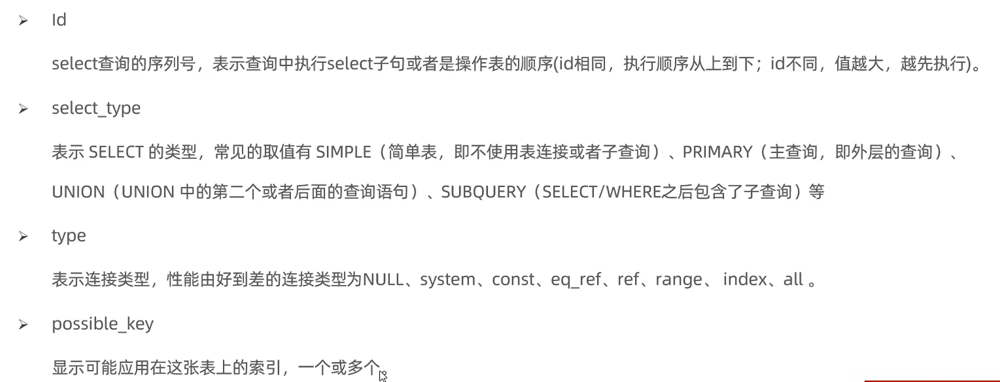
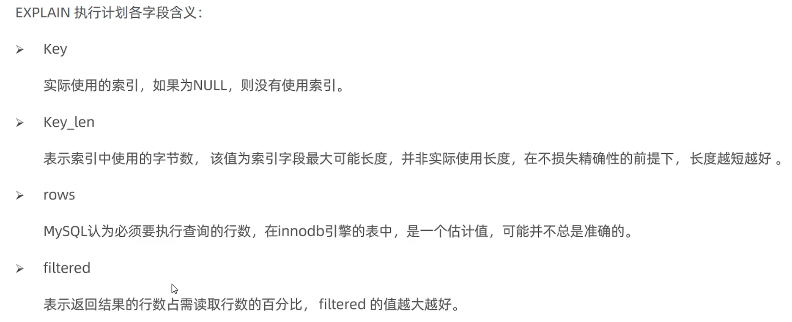
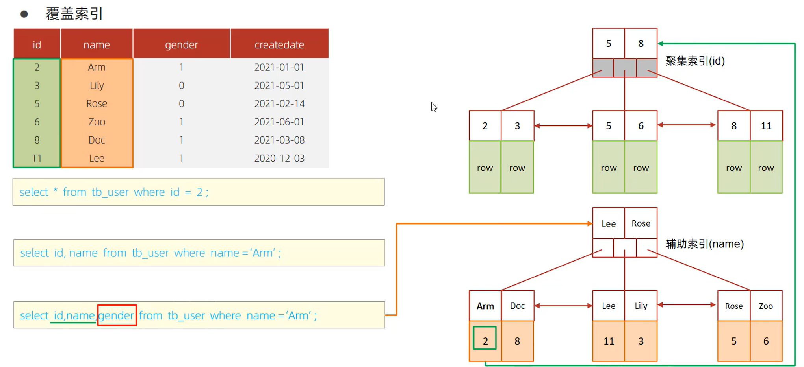
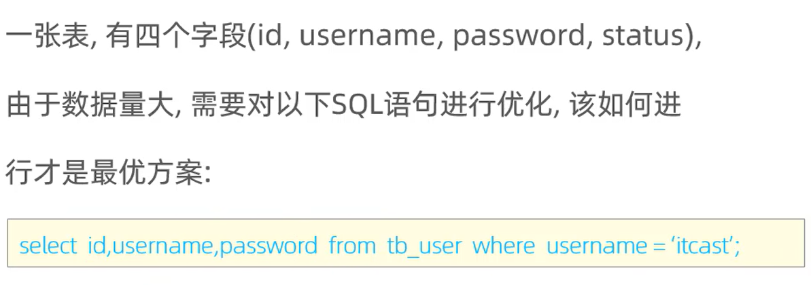

## 数据库-Mysql

> Mysql数据库的关键词：事务、存储引擎、索引、SQL优化、**锁、日志、主从复制、读写分离、分库分表**


## 数据库基础

### 1、Mysql概述

关系型数据库：建立在关系模型基础上，由多张互连接的二维表组成的数据库

特点：使用表存储数据，便于维护；使用sql语句操作，使用方便

**MySQL数据模型**

> 1、客户端通过与数据库管理系统进行连接
>
> 2、使用sql语句通过数据库管理系统对指定的数据库进行增删改查
>
> 3、一个数据库模型中可以对多个数据库进行管理，一个数据库中可以拥有多个表

// TODO数据库模型的图

### 2、SQL

**SQL分类**

| 分类 | 全称                       | 说明                                                 |
| ---- | -------------------------- | ---------------------------------------------------- |
| DDL  | Data Definition Language   | 数据库定义语句，定义数据库对象，数据库，表，字段等   |
| DML  | Data Manipulation Language | 数据库操作语句，用于对数据库表中的数据进行增增删改   |
| DQL  | Data Query Language        | 数据库查询语句，查询数据库表中的记录                 |
| DCL  | Data Control Language      | 数据库控制语句，创建数据库用户，控制数据库的访问权限 |

* #### DDL

  **数据库层次**

```mysql
# 查询所有数据库表格
SHOW DATABASES;
# 查询当前所在的数据库
SELECT DATABASE();
# 创建数据库，方括号可以省略
CREATE DATABASE [IF NOT EXISTS] 数据库名 [COLLATE 排序规则]
# 删除数据库
DROP DATABASE [IF EXISTS] 数据库名
# 使用数据库，切换到数据库当中
USE 数据库名
```

​		表结构

```mysql
# 查看所有表
SHOW TABLES;
# 查询表结构
DESC 表名
# 查询指定表的建表语句
SHOW CREATE TABLE 表名;
```

​		MySQL中的数据类型

| 数据类型       | 描述                                   | 大小                                 |
| -------------- | -------------------------------------- | ------------------------------------ |
| TINYINT        | 微小整数，有符号或无符号（UNSIGNED）   | 1 字节                               |
| SMALLINT       | 小整数，有符号或无符号                 | 2 字节                               |
| MEDIUMINT      | 中等整数，有符号或无符号               | 3 字节                               |
| INT 或 INTEGER | 整数，有符号或无符号                   | 4 字节                               |
| BIGINT         | 大整数，有符号或无符号                 | 8 字节                               |
| FLOAT(M,D)     | 单精度浮点数，M 是总位数，D 是小数位数 | 4 字节                               |
| DOUBLE(M,D)    | 双精度浮点数，M 是总位数，D 是小数位数 | 8 字节                               |
| DECIMAL(M,D)   | 定点数，M 是总位数，D 是小数位数       | 取决于 M 和 D                        |
| DATE           | 日期 YYYY-MM-DD                        | 3 字节                               |
| TIME           | 时间 HH:MM:SS                          | 3 字节                               |
| DATETIME       | 日期和时间                             | 8 字节                               |
| TIMESTAMP      | 时间戳                                 | 4 字节                               |
| CHAR(N)        | **定长**字符串，最大长度为 N           | 最大 255 字节                        |
| VARCHAR(N)     | **变长**字符串，最大长度为 N           | 最大 65,535 字节                     |
| TEXT           | 变长文本，最大长度为 65,535 字节       | 最大 65,535 字节                     |
| BLOB           | 二进制大对象，最大长度为 65,535 字节   | 最大 65,535 字节                     |
| ENUM           | 枚举类型                               | 1 或 2 字节，取决于成员数量          |
| SET            | 集合类型                               | 1、2、3、4 或 8 字节，取决于成员数量 |

创建表：

```mysql
CREATE TABLE member(
    number INT COMMENT '编号',
    id CHAR(10) COMMENT '员工工号',
    name VARCHAR(10) COMMENT '员工姓名',
    gender CHAR(4) COMMENT '员工性别',
    age INT UNSIGNED COMMENT '年龄',
    id_number CHAR(18) COMMENT '身份证号',
    time DATE COMMENT '入职时间'
)
```

**表结构的修改**

```mysql
# 添加字段
ALTER TABLE 表名 ADD 字段名 类型(长度) [COMMENT 注释][约束];

# 修改字段和字段类型
ALTER TABLE 表明 CHANGE 旧字段名 新字段名 类型(长度) [COMMENT 注释][约束]

# 删除字段
ALTER TABLE 表名 DROP 字段名;

# 修改表名
ALTER TABLE 表名 RENAME TO 新表名;

# 删除表
DROP TABLE [IF EXSITS] 表名;
# 删除指定表并重新创建该表，清空数据
TRUNCATE TABLE 表名;
```

* #### DML（数据操作语言）

**添加数据**

```mysql
# 给指定字段添加数据
INSERT INTO 表名(字段名1, 字段名2, ...) VALUES (值1, 值2, ...);

# 给全部字段添加数据
INSERT INTO 表名 VALUES(值1, 值2, ...);
```

**修改数据**

```mysql
# 修改数据
UPDATE 表名 SET 字段名1 = 值1, 字段名2 = 值2, ...[WHERE 条件];
```

**删除数据**

```mysql
# 删除数据
DELETE FROM 表名 [WHERE 条件];
```

* #### DQL

  > 数据库查询语言，用来查询数据库中的表的记录
  >
  > SELECT后面加上\G可以将某一行转化为一列查看

**语法结构**

```mysql
SELECT
	字段列表
FROM
	表名列表
WHERE
	条件列表(条件查询)
GROUP BY
	分组字段列表(分组查询)
HAVING
	分组后条件列表
ORDER BY
	排序字段列表
LIMIT
	分页参数
```

**基本查询**

```mysql
SELECT 字段1 [AS 别名]，字段2 [AS 别名]， FROM 表名;

# 去重
SELECT DISTINCT 字段列表 FROM 表名;
```

**条件查询**

条件运算符

|     比较运算符      |                   功能                   |
| :-----------------: | :--------------------------------------: |
|       <>或!=        |                  不等于                  |
| BETWEEN ... AND ... |              在某个范围之内              |
|       IN(...)       |       在in之后的列表中的值，多选一       |
|     LIKE 占位符     | 模糊匹配(_匹配单个字符，%匹配任意个字符) |
|       IS NULL       |                  是NULL                  |

**聚和函数**

> 将一列数据作为一个整体，进行纵向计算。

所有的null值不参与聚合函数的计算

| 函数  |   功能   |
| :---: | :------: |
| count | 统计数量 |
|  max  |  最大值  |
|  min  |  最小值  |
|  avg  |  平均值  |
|  sum  |   求和   |

```mysql
SELECT 聚合函数(字段列表) FROM 表名;
```

**分组查询**

> 在where中不可以使用聚合函数，在having中可以使用聚合函数
>
> 分组之前过滤用where，分组之后过滤条件用having

```mysql
SELECT 字段列表	FROM 表名 [WHERE 条件] GROUP BY 分组字段名 [HAVING 分组后过滤条件];
```

执行顺序：where > 聚合函数 > having

**排序查询**

```mysql
SELECT 字段列表 FROM 表名 ORDER BY 字段1 排序方式1，字段2 排序方式2
```

排序方式： ASC升序（默认），DESC降序

**分页查询**

```mysql
SELECT 字段列表 FROM 表名 LIMIT 起始索引,查询记录数;
```

显示从起始索引开始的记录数条的查询结果

**DQL执行顺序**

FROM > WHERE > GROUP BY > SELECT > ORDER BY > LIMIT

* #### DCL

> 数据控制语句，用来管理数据库用户，控制数据库访问权限

**DCL用户管理**

```mysql
# 查询用户
USE mysql;
SELECT * FROM user;

# 创建用户，主机名换成"%"表示可以在任意主机访问数据库
CREATE USER '用户名'@'主机名' IDENTIFIED BY '密码';

# 修改用户密码
ALTER USER '用户名'@'主机名' IDENTIFIED WITH mysql_native_password BY '新密码'

# 删除用户
DROP USER '用户名'@'主机名';
```

**权限控制**

常用权限

|        权限         |        说明        |
| :-----------------: | :----------------: |
| ALL, ALL PRIVILEGES |      所有权限      |
|       SELECT        |      查询数据      |
|       INSERT        |      插入数据      |
|       UPDATE        |      修改数据      |
|       DELETE        |      删除数据      |
|        ALTER        |       修改表       |
|        DROP         | 删除数据库/表/视图 |
|       CREATE        |   创建数据库/表    |

```mysql
# 查询权限
SHOW GRANTS FOR '用户名'@'主机名';

# 授予权限
GRANT 权限列表 ON 数据库名.表名(*.*所有表) TO '用户名'@'主机名';

# 撤销权限
REVOKE 权限列表 ON 数据库名.表名 FROM '用户名'@'主机名';
```

### 3、函数

* **字符串函数**

|            函数            |                           功能                            |
| :------------------------: | :-------------------------------------------------------: |
|   CONCAT(S1,S2, ... Sn)    |            字符串拼接，将S1-Sn拼接成一个字符串            |
|         LOWER(str)         |                  将字符串str全部转为小写                  |
|         UPPER(str)         |                   将字符串全部转为大写                    |
|     LPAD(str, n, pad)      | 左填充，用字符串pad对str的左边进行填充，达到n个字符串长度 |
|     RPAD(str, n,  pad)     |                          右填充                           |
|         TRIM(str)          |                去掉字符串头部和尾部的空格                 |
| SUBSTRING(str, start, len) |         返回从字符串str从start起的len长度的字符串         |

```mysql
SELECT 函数;
```

* **数值函数**

|    函数     |                功能                |
| :---------: | :--------------------------------: |
|   CEIL(x)   |              向上取整              |
|  FLOOR(x)   |              向下取整              |
|  MOD(x, y)  |            返回x/y的模             |
|   RAND()    |         返回0~1内的随机数          |
| ROUND(x, y) | 求参数x的四舍五入的值，保留y位小数 |

* **日期函数**

|                函数                |                             功能                             |
| :--------------------------------: | :----------------------------------------------------------: |
|             CURDATE()              |                         返回当前日期                         |
|             CURTIME()              |                         返回当前时间                         |
|               NOW()                |                      返回当前日期和时间                      |
|             YEAR(date)             |                      获取指定date的年份                      |
|            MONTH(date)             |                      获取指定date的月份                      |
|             DAY(date)              |                      获取指定date的日期                      |
| DATE_ADD(date, INTERVAL expr type) | 返回上一个日期加上时间间隔expr以后的时间值，type(year,month,day)指定年月天 |
|       DATEDIFF(date1, date2)       | 返回起始时间date1和结束时间date2之间的天数，第一个时间减去第二个时间 |

* **流程函数**

|                            函数                            |                           功能                           |
| :--------------------------------------------------------: | :------------------------------------------------------: |
|                      IF(value, t. f)                       |            如果value为true，返回t，否则返回f             |
|                   IFNULL(value1, value2)                   |       如果value1不为空，返回value1，否则返回value2       |
|    CASE WHEN [val] THEN [res1] ... ELSE [ default ] END    |    如果val1为true，返回res1，...否则返回default默认值    |
| CASE [expr] WHEN [val1] THEN [res1] ... ELSE [default] END | 如果expr的值等于val1，返回res1，...否则返回default默认值 |

### 4、约束

作用于表中字段上的规则，用于限制存储在表中的数据

|   约束   | 描述 | 关键字 |
| :------: | :--: | :----: |
| 非空约束 |      |        |
| 唯一约束 |      |        |
| 主键约束 |      |        |
| 默认约束 |      |        |
| 检查约束 |      |        |
| 外键约束 |      |        |


### 5、多表查询

* **多表关系**

  一对多：在多的一方建立外键，指向一的一方的主键

​		多对多：建立第三张中间表，中间表至少包含两个外键，分别关联两方的主键

​		一对一：用于做单表拆分，基础字段放在一张表，详情字段放在另一张表。在任意一方加入外键，关联另一方的主键，并设置外键为唯一（UNIQUE）

* **多表查询**

  * 内连接

    > 相当于查询A、B交集部分数据

  ```mysql
  # 隐式内连接
  SELECT 字段列表 FROM 表1，表2 WHERE 条件...;
  
  # 显示内连接
  SELECT 字段列表 FROM 表1 [INNER] JOIN 表2 ON 连接条件;
  ```

  * 外连接

    > 左外连接：查询左表所有数据，以及两张表交集部分数据，将左表的数据和右表的部分数据连接起来
    >
    > 右外连接：查询右表所有数据，以及两张表交集部分数据

  ```mysql
  # 左外连接，表1所有数据以及和表2交集部分的数据
  SELECT 字段列表 FROM 表1 LEFT [OUTER] JOIN 表2 ON 条件;
  
  # 右外连接，表2所有数据以及和表1交集部分的数据
  SELECT 字段列表 FROM 表1 RIGHT [OUTER] JOIN 表2 ON 条件;
  ```

  * 自连接

    > 自连接：当前表与自身的连接查询，自连接必须使用表别名

  * 联合查询-union，union all

  ```mysql
  # 把多次查询的结果合并起来，形成一个新的查询结果集
  # ALL去掉以后会对结果进行去重
  SELECT 字段列表 表A
  UNION [ALL]
  SELECT 字段列表 表B;
  ```

* **子查询**

  * 标量子查询，子查询返回一个标量

  * 列子查询，子查询返回一列

    | 操作符 |                 描述                 |
    | :----: | :----------------------------------: |
    |   IN   |     在指定的集合范围之内，多选一     |
    | NOT IN |          不在指定的范围之内          |
    |  ANY   | 子查询返回列表中，有任意一个满足即可 |
    |  SOME  |              与ANY等同               |
    |  ALL   |   子查询返回列表的所有值都必须满足   |

  * 行子查询，子查询返回的结果是一行

    此时column1可以使用(column1， column2)聚合成多个参数

    操作符：=、<>、IN、NOT IN

  * 表子查询，子查询的返回结果是一个表，可以和行子查询加上列子查询的操作符使用，表可以放到from后面

```mysql
# 对于子查询，可以将问题拆解成多个不同的查询步骤
SELECT * FROM t1 WHERE column1 = (SELECT column1 FROM t2);
```

### 6、事务

> 一组操作的集合，是一个不可分割的工作单位，事务会把所有的操作作为一个整体一起向系统提交或撤销操作请求，这些操作要么**同时成功，要么同时失败**
>
> 默认Mysql的事务是自动提交的，当执行一条DML语句，Mysql会立即隐式的提交事务

* **事务操作**

```mysql
# 查看/设置事务提交方式
SELECT @@autocommit;
# 事务设置为手动提交
SET @@autocommit = 0;

# 提交事务
COMMIT;

# 回滚事务
ROLLBACK;
```

```mysql
# 不修改事务的提交方式操作事务
# 开启事务
START TRANSACTION 或 BEGIN;

# 提交事务
COMMIT;

# 回滚事务
ROLLBACK;
```

* **事务四大特性**

  * 原子性(Atomicity)：事务时不可分割的最小操作单元，要么全部成功，要么全部失败
  * 一致性(Consistency)：事务完成时，必须使所有的数据都保持一致状态
  * 隔离性(Isolation)：数据库系统提供的隔离机制，保证事务在不受外部并发操作影响的独立环境下运行
  * 持久性(Durability)：事务一旦提交或者回滚，它对数据库中的数据改变就是永久的

* **并发事务问题**

  |    问题    |                             描述                             |
  | :--------: | :----------------------------------------------------------: |
  |    脏读    |            一个事务读到另一个事务还没有提交的数据            |
  | 不可重复读 | 一个事务先后读取同一条记录，但两次读取的数据不同，称为不可重复读 |
  |    幻读    | 一个事务按照条件查询数据时，没有对应的数据行，但是在插入数据时，又发现这一行数据已经存在 |

* **事务隔离级别**

  > 读未提交、读已提交、可重复读、串行化
  >
  > √表示会出现这个问题，×表示不会出现这个问题

  |     隔离级别     | 脏读 | 不可重复读 | 幻读 |
  | :--------------: | :--: | :--------: | :--: |
  | Read uncommitted |  √   |     √      |  √   |
  |  Read committed  |  ×   |     √      |  √   |
  | Repeatable Read  |  ×   |     ×      |  √   |
  |   Serializable   |  ×   |     ×      |  ×   |

  ```mysql
  # 查看事务的隔离级别
  SELECT @@TRANSACTION_ISOLATION;
  
  # 设置事务隔离级别
  SET [SESSION(只对当前窗口有效)|GLOBAL] TRANSACTION ISOLATION LEVEL {隔离级别}
  ```

  事务的隔离界别越高，数据越安全，但是性能越低

## 数据库进阶

### 1、存储引擎

* Mysql体系结构 

  连接层：完成一些类似于连接处理、授权认证及相关的安全方案

  服务层：主要完成大多数的核心服务功能

  引擎层：负责mysql中数据的存储和提取，服务器通过API和存储引擎进行通信

  存储层：将数据存储在文件系统之上，并完成与存储引擎的交互

  

* 存储引擎

  > 存储引擎就是存储数据、建立索引、更新/查询数据等技术的实现方式。存储引擎时基于表的，而不是基于库的。一个数据库的不同的表可以选择不同的存储引擎
  >
  > Mysql默认InnoDB

```mysql
# 查询支持的存储引擎
show engines;
```

* InnoDB

  * DML操作遵循ACID模型，支持事务
  * 行级锁，提高并发访问性能
  * 支持外键，保证事务的完整性和正确性

  文件：每个表对应一个.ibd文件，代表表空间文件，可以通过命令`idb2sdi 文件名`查看表结构json文件格式

  

* MyISAM

  * 不支持事务，不支持外键
  * 支持表锁、不支持行锁
  * 访问速度快

  文件.MYD（数据），.MYI（索引），.sdi（表结构）

* Memory

  * 表数据存储在内存当中，收到硬件问题或断电影响只能作为临时表或者缓存使用
  * 内存存放
  * hash索引（默认）


* 存储引擎选择

  InnoDB：如果对事务的完整性有比较高的要求，在并发情况下要求事务的一致性，数据操作除了插入和查询意外，还包括很多的更新、删除操作，InnoDB引擎比较合适

  MyISAM：如果应用是以读操作和插入操作为主，只有很少的更新和删除操作，并且对事务的完整性和并发现要求不是很高。**这个场景被Nosql数据库MongoDB替代了**

  MEMORY：将所有数据保存在内存当中，访问速度快，通常用于临时表以及缓存。MEMORY对表的大小有限制，太大的表无法缓存在内存中。**这个场景被Redis替代了**

### 2、索引

* **索引概述**
  * 索引的结构

* #### **索引分类**

|   分类   |                含义                |           特点           |  关键字  |
| :------: | :--------------------------------: | :----------------------: | :------: |
| 主键索引 |      针对于表中主键创建的索引      | 默认自动创建，只能有一个 | PRIMARY  |
| 唯一索引 |  避免同一个表中某数据列中的值重复  |        可以有多个        |  UNIQUE  |
| 常规索引 |          快速定位特定数据          |        可以有多个        |          |
| 全文索引 | 全文索引查找的是文本中通过的关键词 |        可以有多个        | FULLTEXT |

按照索引的存储形式分类

|   分类   |                            含义                            |         特点         |
| :------: | :--------------------------------------------------------: | :------------------: |
| 聚集索引 |                 将数据存储与索引放到了一块                 | 必须有，而且只有一个 |
| 二级索引 | 将数据与索引分开存储，索引结构的叶子节点关联的是对应的主键 |     可以存在多个     |


* #### **索引语法**

```mysql
# 创建索引
# 一个索引可以关联多行，如果关联多行称为联合索引
CREATE [UNIQUE|FULLTEXT] INDEX index_name ON table_name (index_col_name, )

# 查看索引
SHOW INDEX FROM table_name;

# 删除索引
DROP INDEX index_name ON table_name;
```

* #### **SQL性能分析**

  > 使用于select的优化

```mysql
# SQL执行频率，查看当前数据库语句的访问频率
SHOW [session|global] STATUS
# Com七个下划线，模糊匹配
SHOW GLOBAL STATUS LIKE 'Com_______'
```

**SQL语句的频率**


**慢查询日志**

> 慢查询日志记录了所有执行时间超过指定参数(long_query_time，单位：秒，默认10)的所有SQL语句的日志

```mysql
# 查看是否开启，日志文件默认在/var/lib/mysql里面
SHOW VARIABLES LIKE 'slow_query_log';

# 修改/etc/my.cnf中配置开启，配置时间
slow_query_log=1   
long_query_time=2
```

**profile详情**

```mysql
# 查看是否支持prifile
SELECT @@have_profiling;

# 设置为开
SET profiling=1;

# 查看profile
SHOW PROFILES;
```

执行完SQL语句以后，通过以下指令查看执行耗时情况

```mysql
# 查看每一条SQL耗时基本情况
SHOW PROFILES;

# 查看指定query_id的SQL语句各个阶段的耗时情况
SHOW PROFILE FOR QUERY query_id;

# 查看指定SQL语句的CPU使用情况
SHOW PROFILE CPU FOR QUERY query_id;
```

**explain执行计划**

> EXPLAIN或者DESC命令获取Mysql如何执行SELECT语句的信息，包括在SELECT语句执行过程中表如何连接和连接的顺序

```mysql
EXPLAIN SELECT SQL语句;
```


表头的含义：





```txt
type
const	以主键或以唯一的列作为索引扫描
ref		非唯一的值作为查询索引
index	用了索引，但是会对整个索引进行遍历
all		全表扫描
```

* #### **索引使用**

**联合索引**

使用要遵循**最左前缀法则**：查询**从索引的最左列开始**，并且不跳过索引中的列。如果跳跃某一列，索引将部分失效（后面的字段索引失效）。

**范围查询**：联合索引中出现范围查询（>,<)，范围查询右侧的列索引失效。但是使用大于等于和小于等于索引并不会失效。

例子

```mysql
# student有联合索引(id,name,age)
# 1、索引都可以使用
select * from student where id = 1 and name = "Lili" and age = 20;

# 2、索引name，age失效
select * from student where id = 1 and age = 20;

# 范围查询
# name和age索引均失效
select * from student where id > 1 and name = "Lili" and age = 20;
```

**索引失效**

索引列操作：不要在索引上进行列操作，否则索引会失效

字符串类型：不加单引号索引会失效

模糊查询：**头部进行模糊匹配(%%某某)**，索引会失效，尾部进行模糊匹配（某某%%），索引不会失效。

or连接的条件：如果or前面的条件列有索引，后面的条件没有索引，所涉及的索引都不会引用到，只有两侧都有索引的时候，才有效

数据分布影响：如果索引比全表扫描更慢，则不使用索引，查询的数据大于一半，走全表不走索引。

**SQL提示**

> 在sql语句中加入一些认为的提示来达到优化操作的目的

```mysql
# use index指定使用哪个索引
explain select * from table use index(idxname) ...

# ignore index
# force index 同上
```

**覆盖索引**

尽量使用覆盖索引：查询使用了索引，并且需要返回的列，在该索引中已经能够全部找到，减少使用select *

using index condition：查找使用了索引，但是需要回表查询数据

using where, using index：查询使用了索引，但是不需要回表



前两条不需要回表，后一条需要回表

**前缀索引**

> 将字符串的前缀提取出来，创建索引，可以节约索引空间

```mysql
# n表示取column_name列的前n个数据
CREATE INDEX idx_XXX ON table_name(column_name(n));

# 计算前缀长度的选择性，越接近1越好
SELECT COUNT(DISTINCT substring(email, 1, 5)) / COUNT(*) FROM table_name;
```

**单列索引和联合索引选择**

如果涉及到多个查询条件，推荐使用联合索引，联合索引会更少的回表查询

#### Quetion



建立id主键，username，password联合索引

* #### **索引设计原则**


### 3、SQL优化

* #### **插入数据**insert优化

  批量插入而不是单条插入：批量插入只需要建立一次连接即可

  建议手动提交事务：不需要每一次插入时自动开启和关闭事务，而是将所有insert执行结束以后统一关闭

  **建议主键顺序插入**

  大批量插入数据：使用Mysql数据库提供的load指令进行插入

  ```mysql
  # 如何使用load
  # 1、连接服务器时加上参数--local-infile
  mysql --local-infile -u root -p
  
  # 2、设置全局参数local_infile为1
  set global local_infile = 1;
  
  # 3、执行load指令将数据加载表结构中
  load data local infile '文件名' into table '表名' fields teminated by '分割符' lines terminated by '行分隔符\n';
  ```

* #### **主键优化**

> InnoDB中表数据都是根据主键顺序组织存放的，这种存储方式的表称为索引组织表。

页大小为16kb，每个页至少包含两行数据

主键乱序插入可能会出现页分裂现象，执行删除操作会出现页合并现象

主键设计原则：

​	满足业务需求的情况下，尽量降低主键的长度

​	插入时尽量按照主键顺序插入，选择自增主键

​	尽量不要使用无序的自然主键

​	业务操作，避免对主键的修改

* **order by优化**

排序方式

Using filesort：先找到数据再进行排序

Using index：通过有序索引直接返回，不需要额外排序

默认会对索引进行升序排序

* **limit优化**

对于数据量大的，优化思路为使用覆盖索引+子查询

* count

  count(*)优于count(1)>count(主键)>count(字段)

* #### **update优化**

对需要更新的字段尽可能建立索引，这样如果处于多个事务情况下，只会使用行锁，如果没有建立索引，行锁会升级为表锁，无法进行并行

### 4、视图/存储过程/触发器

* #### 视图

> 视图（View）是一种虚拟存在的表。视图中的数据并不在数据库中实际存在，行和列数据来自定义视图的查询中使用的表，并且是在使用视图时动态生成的。

* #### 存储过程

> 存储过程是事先经过编译并存储在数据库中的一段SQL语句的集合，调用存储过程可以简化应用开发人员的很多工作，减少数据在数据库和应用服务器之间的传输
>
> 思想上就是数据库SQL语言层面的代码封装与重用，下一次如果执行相同的业务直接调用存储过程

**特点**	好像跟函数有点像

封装、复用

可以接收参数，也可以返回数据

作用：减少网络交互，提升效率

> 在命令行中，执行创建存储过程的sql时，需要通过关键字`delimiter`指定SQL语句的结束符

```mysql
# 创建
# 参数列表为IN/OUT/INOUT 参数名，分别表示参数输入，输出，输入和输出参数
CREATE PROCEDURE 存储过程名称([参数列表])
BEGIN
	--SQL语句，可以是多条
END;

# 调用
CALL 名称([参数列表]);

# 查看
# 方法一，查看系统的数据库表，xxx为数据库名
SELECT * FROM INFORMATION_SCHEMA.ROUTINES WHERE ROUTINE_SCHEMA = 'XXX';
# 方法二，使用show查看创建过程
SHOW CREATE PROCEDURE 存储过程名称;

# 删除
DROP PROCEDURE [IF EXISTS] 存储过程名称;

# 定义结束符为$$
delimiter $$
```

**系统变量**（全局GLOBAL，会话SESSION）

重启以后系统参数会恢复为默认值

永久修改系统参数需要修改/etc/my.cnf中配置

```mysql
# 查看所有系统变量
SHOW [SESSION|GLOBAL] VARIABLES;
SHOW VARIABLES LIKE '..';
# 查看指定变量
SELECT @@[SESSION|GLOBAL].系统变量名

# 设置系统变量，默认为SESSION级别
SET [SESSION|GLOBAL] 变量名=值;
SET @@[SESSION|GLOBAL].系统变量名 = 值;
```

**用户自定义变量**

> 作用域为当前连接
>
> 变量无需声明，如果拿到的是没有声明的变量，则会获得NULL

```mysql
# 赋值，可以同时赋值多个变量，用逗号隔开
SET @var_name = expr;
SET @var_name := expr;

# SELECT赋值
SELECT @var_name := expr;
# 将sql查询的结果赋值给变量
SELECT 字段名 INTO @var_name FROM 表名;

# 使用
SELECT @var_name;
```

**局部变量**

> 在局部生效，需要DECLARE声明，作用域在BEGIN...END块内

```mysql
# 声明
DECLARE 变量名 变量类型(数据库数据的类型) [DEFAULT 默认值]

# 赋值
SET 变量名 = 值;
SET 变量名 := 值;
SELECT 字段名 INTO @var_name FROM 表名;
```

**存储过程相关语法**

> 逻辑语言都在存储过程中定义，可以使用传入的参数

```mysql
# IF 条件判断
IF 条件1 THEN
	...
ELSEIF 条件2 THEN
	...
ELSE
	...
END IF;

# CASE 条件选择，WHEN后面可以有多种选择
# 语法一
CASE case_value
	WHEN when_value1 THEN ...
	WHEN when_value2 THEN ...
	ELSE ...
END CASE;
# 语法二
CASE 
	WHEN 表达式真 THEN ...
	ELSE ...
END CASE;

# WHILE循环
WHILE 条件 DO
	SQL逻辑
END WHILE：

# REPEAT循环，当满足条件时，退出循环
REPEAT
	SQL逻辑...
	UNTIL 条件
END REPEAT;

# LOOP循环
# LOOP实现的是简单循环
# LEAVE：配合循环使用，退出循环，作用类似于break
# ITERATE：必须在循环中使用，作用类似于CONTINUE
[begin_label:] LOOP
	SQL逻辑
	
END LOOP[end_label]

# 退出循环
LEAVE label;
# 跳过本次进入下一次循环
ITERATE label;
```

**游标Cursor**

游标（Cursor）是一种用于在存储过程或函数中遍历结果集的机制。游标允许逐行访问结果集，并在每行上执行相应的操作

通常情况下，当执行一个查询语句时，MySQL 会返回一个结果集，该结果集包含了查询返回的所有行。以使用游标来逐行处理这个结果集，而不是一次性获取所有结果。这在处理大量数据或需要逐行处理结果的情况下非常有用

```mysql
# 声明游标、打开游标、获取下一行、关闭游标
DELIMITER //

CREATE PROCEDURE process_users()
BEGIN
    DECLARE done INT DEFAULT FALSE;
    DECLARE user_id INT;
    DECLARE user_name VARCHAR(255);

    -- 声明游标
    DECLARE user_cursor CURSOR FOR 
        SELECT id, name FROM users;

    -- 打开游标
    OPEN user_cursor;

    -- 循环遍历结果集
    read_loop: LOOP
        -- 获取下一行数据
        FETCH user_cursor INTO user_id, user_name;
        IF done THEN
            LEAVE read_loop;
        END IF;
        
        -- 处理当前行数据
        -- 这里可以执行相应的操作，如输出到日志或进行其他逻辑处理
        SELECT CONCAT('User ID: ', user_id, ', User Name: ', user_name);

    END LOOP;

    -- 关闭游标
    CLOSE user_cursor;

END //

DELIMITER ;
```


* #### 存储函数

* #### 触发器

### 5、锁

### 6、InnoDB核心

### 7、MySQL管理


## 数据库运维

### 1、日志

### 2、主从复制

### 3、分库分表

### 4、读写分离

### 
