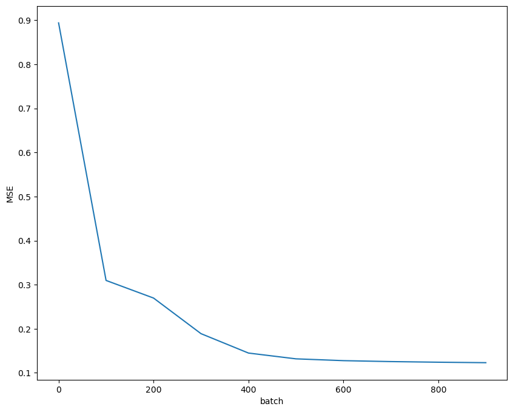
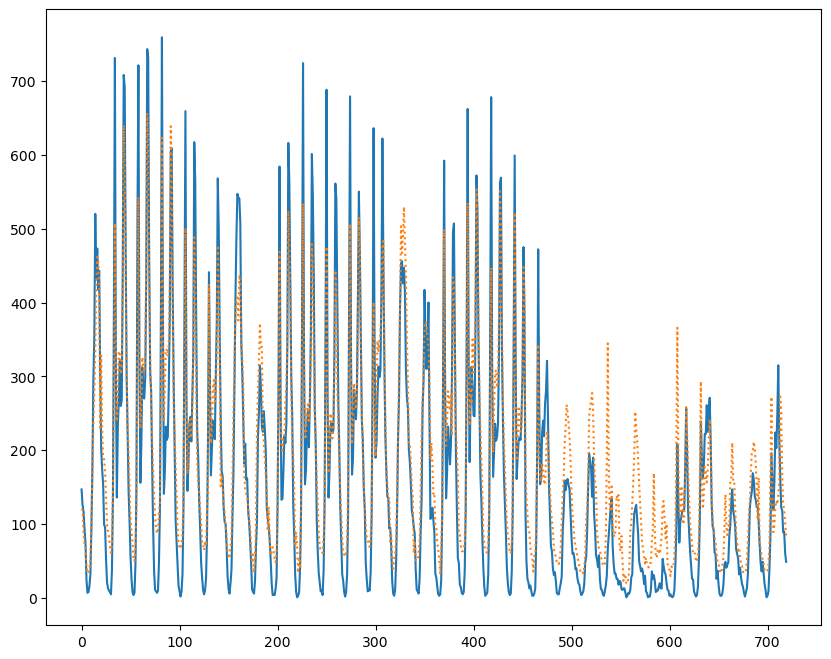

# 实验二、共享单车预测

### **内容**

1、通过历史数据预测某一地区接下来一段时间内的共享单车的数量。数据保存在文件bikes.csv中，请按11：1的比例划分训练集和测试集，首先对数据进行预处理，然后在训练集上训练，并在测试集上验证模型。

2、设计神经网络对数据进行拟合，利用训练后的模型对数据拟合并进行预测，记录误差，并绘制拟合效果。

### **完成情况**

1、数据预处理

完成程度：使用pandas读取原始数据bikes.csv，对离散数据使用one-hot编码处理，对连续数据进行标准化处理，将数据划分成11训练集：1测试集。删除某些处理过后的列，将标签列于数据分离。

2、设计神经网络拟合

完成程度：搭建神经网络，隐藏层包含10个Linear，通过Sigmoid函数进行非线性化处理，再通过输出层对数据进行输出。使用MSELoss损失误差，采用随机梯度下降的方法，设置学习率为0.01，batch_size=128。对训练集进行训练，用得到的模型对测试集进行测试，通过绘制图像进行对比分析。


## 读取原始数据，进行数据预处理


```python
# 导入相关包和函数
import torch
import numpy as np
import pandas as pd
import torch.optim as optim
from matplotlib import pyplot as plt
```


```python
# 读入数据并进行数据处理
data = pd.read_csv('bikes.csv')
col_titles = ['season', 'weathersit', 'mnth', 'hr', 'weekday']
for i in col_titles:
    dummies = pd.get_dummies(data[i], prefix=i)
    data = pd.concat([data, dummies], axis=1)

col_titles_to_drop = ['instant', 'dteday'] + col_titles
print(col_titles_to_drop)
data = data.drop(col_titles_to_drop, axis=1)
data.head()
```

    ['instant', 'dteday', 'season', 'weathersit', 'mnth', 'hr', 'weekday']

<table border="1" class="dataframe">
  <thead>
    <tr style="text-align: right;">
      <th></th>
      <th>holiday</th>
      <th>workingday</th>
      <th>temp</th>
      <th>hum</th>
      <th>windspeed</th>
      <th>cnt</th>
      <th>season_1</th>
      <th>season_2</th>
      <th>season_3</th>
      <th>season_4</th>
      <th>...</th>
      <th>hr_21</th>
      <th>hr_22</th>
      <th>hr_23</th>
      <th>weekday_0</th>
      <th>weekday_1</th>
      <th>weekday_2</th>
      <th>weekday_3</th>
      <th>weekday_4</th>
      <th>weekday_5</th>
      <th>weekday_6</th>
    </tr>
  </thead>
  <tbody>
    <tr>
      <th>0</th>
      <td>0</td>
      <td>0</td>
      <td>0.24</td>
      <td>0.81</td>
      <td>0.0</td>
      <td>16</td>
      <td>1</td>
      <td>0</td>
      <td>0</td>
      <td>0</td>
      <td>...</td>
      <td>0</td>
      <td>0</td>
      <td>0</td>
      <td>0</td>
      <td>0</td>
      <td>0</td>
      <td>0</td>
      <td>0</td>
      <td>0</td>
      <td>1</td>
    </tr>
    <tr>
      <th>1</th>
      <td>0</td>
      <td>0</td>
      <td>0.22</td>
      <td>0.80</td>
      <td>0.0</td>
      <td>40</td>
      <td>1</td>
      <td>0</td>
      <td>0</td>
      <td>0</td>
      <td>...</td>
      <td>0</td>
      <td>0</td>
      <td>0</td>
      <td>0</td>
      <td>0</td>
      <td>0</td>
      <td>0</td>
      <td>0</td>
      <td>0</td>
      <td>1</td>
    </tr>
    <tr>
      <th>2</th>
      <td>0</td>
      <td>0</td>
      <td>0.22</td>
      <td>0.80</td>
      <td>0.0</td>
      <td>32</td>
      <td>1</td>
      <td>0</td>
      <td>0</td>
      <td>0</td>
      <td>...</td>
      <td>0</td>
      <td>0</td>
      <td>0</td>
      <td>0</td>
      <td>0</td>
      <td>0</td>
      <td>0</td>
      <td>0</td>
      <td>0</td>
      <td>1</td>
    </tr>
    <tr>
      <th>3</th>
      <td>0</td>
      <td>0</td>
      <td>0.24</td>
      <td>0.75</td>
      <td>0.0</td>
      <td>13</td>
      <td>1</td>
      <td>0</td>
      <td>0</td>
      <td>0</td>
      <td>...</td>
      <td>0</td>
      <td>0</td>
      <td>0</td>
      <td>0</td>
      <td>0</td>
      <td>0</td>
      <td>0</td>
      <td>0</td>
      <td>0</td>
      <td>1</td>
    </tr>
    <tr>
      <th>4</th>
      <td>0</td>
      <td>0</td>
      <td>0.24</td>
      <td>0.75</td>
      <td>0.0</td>
      <td>1</td>
      <td>1</td>
      <td>0</td>
      <td>0</td>
      <td>0</td>
      <td>...</td>
      <td>0</td>
      <td>0</td>
      <td>0</td>
      <td>0</td>
      <td>0</td>
      <td>0</td>
      <td>0</td>
      <td>0</td>
      <td>0</td>
      <td>1</td>
    </tr>
  </tbody>
</table>
<p>5 rows × 57 columns</p>

</div>


```python
# 对连续数据进行标准化处理
col_titles = ['cnt', 'temp', 'hum', 'windspeed']
for i in col_titles:
    mean, std = data[i].mean(), data[i].std()
    if i == 'cnt':
        mean_cnt, std_cnt = mean, std
    
    data[i] = (data[i] - mean)/std
```


```python
# 数据集处理
test_data = data[-30*24:]
train_data = data[:-30*24]

# 删除标签类
X = train_data.drop(['cnt'], axis=1)
X = X.values
Y = train_data['cnt']
Y = Y.values.astype(float)
Y = np.reshape(Y, [len(Y), 1])
```


```python
# 搭建神经网络
input_size = X.shape[1]
hidden_size = 10
output_size = 1
batch_size = 128

neu = torch.nn.Sequential(
    torch.nn.Linear(input_size, hidden_size),
    torch.nn.Sigmoid(),
    torch.nn.Linear(hidden_size, output_size)
)
loss_fn = torch.nn.MSELoss()
opt = torch.optim.SGD(neu.parameters(), lr=0.01)
```


```python
# 训练模型
losses = []
for i in range(1000):
    batch_loss = []
    for start in range(0, len(X), batch_size):
        if start+batch_size<len(X):
            end = start+batch_size
        else:
            end = len(X)

        # 生成一个batch的训练数据
        x = torch.FloatTensor(X[start:end])
        y = torch.FloatTensor(Y[start:end])

        pred = neu(x)
        loss = loss_fn(pred, y)
        opt.zero_grad()
        loss.backward()
        opt.step()
        batch_loss.append(loss.data.numpy())
    if i%100==0:
        losses.append(np.mean(batch_loss))
        print(i, np.mean(batch_loss))
        
plt.figure(figsize=(10, 8))
plt.plot(np.arange(len(losses))*100, losses)
plt.xlabel('batch')
plt.ylabel('MSE')
plt.show()
```

    0 0.8939656
    100 0.30960146
    200 0.26964802
    300 0.18884033
    400 0.14483929
    500 0.1316976
    600 0.12759094
    700 0.12547289
    800 0.12405107
    900 0.12297937



    


```python
# 测试，验证
X = test_data.drop(['cnt'], axis=1)
Y = test_data['cnt']
Y = Y.values.reshape([len(Y), 1])
X = torch.FloatTensor(X.values)
Y = torch.FloatTensor(Y)
pred = neu(X)

Y = Y.data.numpy()*std_cnt+mean_cnt
pred = pred.data.numpy()*std_cnt+mean_cnt

plt.figure(figsize=(10, 8))
xplot, = plt.plot(np.arange(X.size(0)), Y)
yplot, = plt.plot(np.arange(X.size(0)), pred, ':')
plt.show()
```


​    

​    

