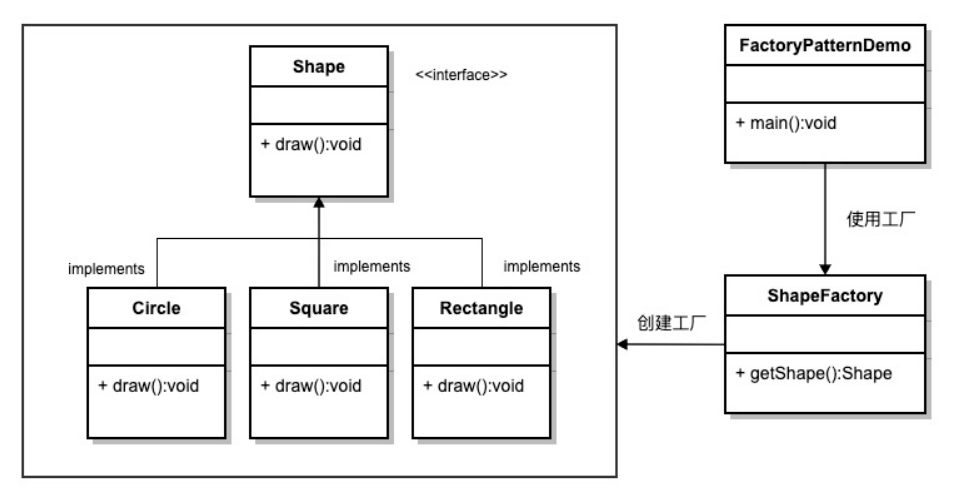
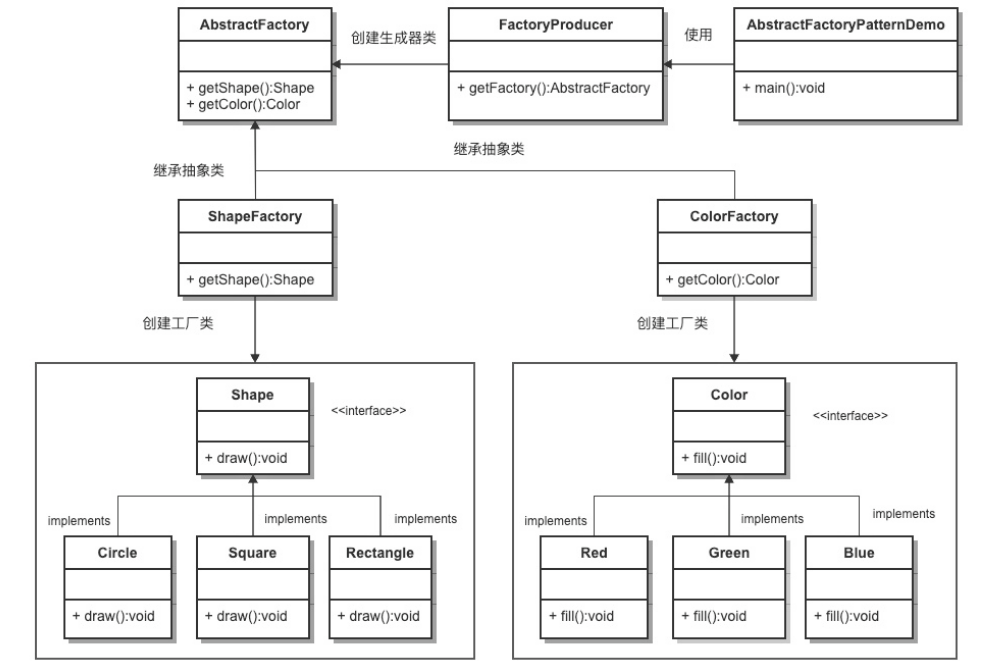
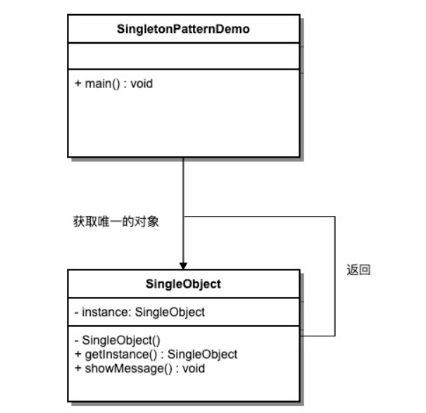
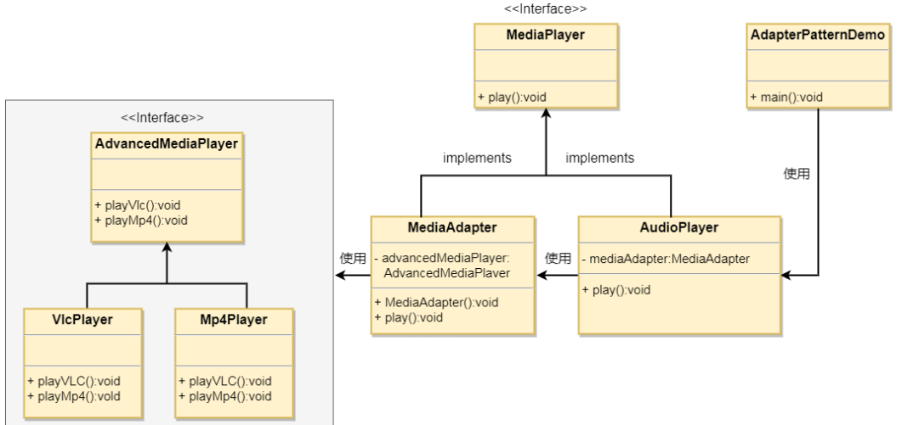
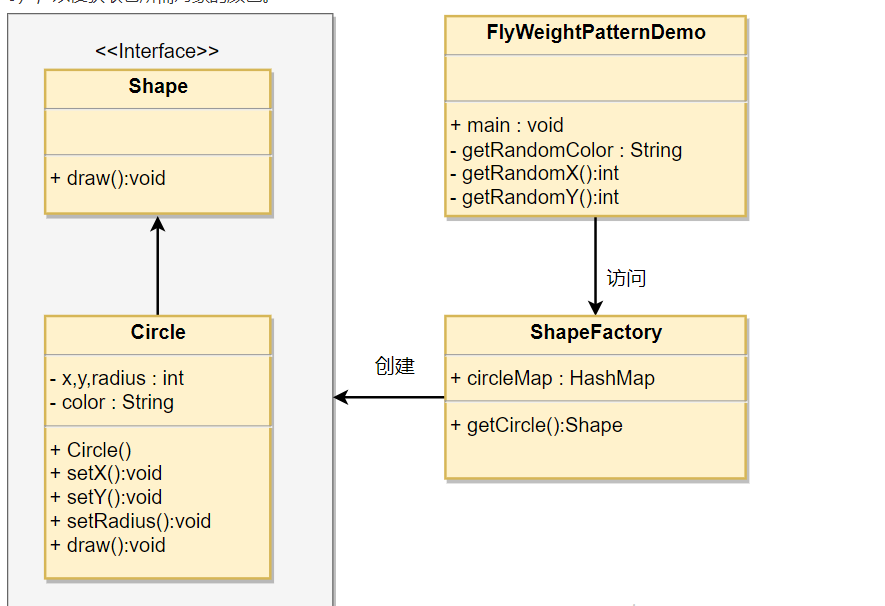
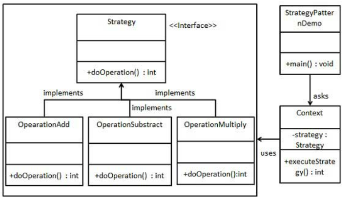

### 

# 设计模式

> 设计模式是软件开发人员在软件开发过程中面临的一般问题的解决方案。是众多软件开发人员经过相当长的一段时间的试验和错误总结出来的代码编写经验。使用设计模式是为了重用代码、让代码更容易被他人理解、保证代码可靠性。

## 设计模式六大原则

**1、开闭原则（Open Close Principle）**

开闭原则的意思是：对扩展开放，对修改关闭。在程序需要进行拓展的时候，不能去修改原有的代码，实现一个热插拔的效果。简言之，是为了使程序的扩展性好，易于维护和升级。

**2、里氏代换原则（Liskov Substitution Principle）**

里氏代换原则是面向对象设计的基本原则之一。里氏代换原则中说，任何基类可以出现的地方，子类一定可以出现。LSP 是继承复用的基石，只有当派生类可以替换掉基类，且软件单位的功能不受到影响时，基类才能真正被复用，而派生类也能够在基类的基础上增加新的行为。里氏代换原则是对开闭原则的补充。实现开闭原则的关键步骤就是抽象化，而基类与子类的继承关系就是抽象化的具体实现，所以里氏代换原则是对实现抽象化的具体步骤的规范。

**3、依赖倒转原则（Dependence Inversion Principle）**

这个原则是开闭原则的基础，具体内容：针对接口编程，依赖于抽象而不依赖于具体。

**4、接口隔离原则（Interface Segregation Principle）**

这个原则的意思是：使用多个隔离的接口，比使用单个接口要好。它还有另外一个意思是：降低类之间的耦合度。由此可见，其实设计模式就是从大型软件架构出发、便于升级和维护的软件设计思想，它强调降低依赖，降低耦合。

**5、迪米特法则，又称最少知道原则（Demeter Principle）**

最少知道原则是指：一个实体应当尽量少地与其他实体之间发生相互作用，使得系统功能模块相对独立。

**6、合成复用原则（Composite Reuse Principle）**

合成复用原则是指：尽量使用合成/聚合的方式，而不是使用继承。

## 一、工厂模式

> 工厂模式是一种创建对象的方式，类似于利用统一工厂类去创建不同的对象，这样就能够让创建对象的过程和使用对象的过程进行分离。



* 简单工厂模式

    根据工厂类传入的参数来决定创建哪种类型的对象

* 工厂方法模式

    定义一个创建对象的接口，但由子类来决定实例化哪一个类，将对象的创建延迟到子类

    不同的产品类继承于同一个抽象产品基类，同时为每一个产品类分配一个单独的创建类，创建类继承于创建基类，创建基类中有一个用于接收产品基类返回值的抽象方法，所有的创建类会重新这个方法，并在这个方法中，创建对应的产品对象，返回给产品基类接收。

    在创建基类中，同时会定义一个接口方法，这个方法的实现会先通过抽象方法先创建出一个产品抽象类，并调用产品抽象类中的抽象方法，就能够达到统一调用子类方法的目的。

    在实际使用中，用户只需要知道创建抽象类以及抽象类中的方法即可，当我们需要使用某一个产品的时候，我们只需要通过使用创建基类的指针指向一个某一个产品的创建子类的对象，通过调用创建基类中的方法就可以完成对应的功能。

    ```C++
    #include <iostream>
    #include <memory>

    // 产品基类
    class Product {
    public:
        virtual ~Product() {}
        virtual std::string Operation() const = 0;
    };

    // 具体产品A
    class ConcreteProductA : public Product {
    public:
        std::string Operation() const override {
            return "Result of the ConcreteProductA";
        }
    };

    // 具体产品B
    class ConcreteProductB : public Product {
    public:
        std::string Operation() const override {
            return "Result of the ConcreteProductB";
        }
    };

    // 创建者基类
    class Creator {
    public:
        virtual ~Creator() {}
        // 工厂方法，用于创建产品对象
        virtual Product* FactoryMethod() const = 0;

        // 创建者类的业务逻辑
        std::string SomeOperation() const {
            // 调用工厂方法来创建一个产品对象
            std::unique_ptr<Product> product(this->FactoryMethod());
            // 使用产品
            std::string result = "Creator: The same creator's code has just worked with " + product->Operation();
            return result;
        }
    };

    // 具体创建者A
    class ConcreteCreatorA : public Creator {
    public:
        Product* FactoryMethod() const override {
            return new ConcreteProductA();
        }
    };

    // 具体创建者B
    class ConcreteCreatorB : public Creator {
    public:
        Product* FactoryMethod() const override {
            return new ConcreteProductB();
        }
    };

    void ClientCode(const Creator& creator) {
        // ...
        std::cout << "Client: I'm not aware of the creator's class, but it still works.\n"
                << creator.SomeOperation() << std::endl;
        // ...
    }

    int main() {
        std::unique_ptr<Creator> creator = std::make_unique<ConcreteCreatorA>();
        ClientCode(*creator);

        std::cout << std::endl;
        
        creator = std::make_unique<ConcreteCreatorB>();
        ClientCode(*creator);
        
        return 0;
    }
    ```

* 抽象工厂模式

    

    提供一个创建一系列相关或互相依赖对象的接口，而无需指定它们具体的类

    我们可以看出来工厂方法模式只关注某一类产品的构建，但是我们可以通过对抽象产品的继承来丰富这一类产品的类型。如果我们有多类产品的话，那就需要用到抽象工厂了。

    因为我们有多类产品，所以我们会定义多个产品的抽象基类，这些产品基类会由多个产品子类来继承生成不同产品，在子类中会分别实现不同产品基类的抽象方法，如果我们需要在不同的产品类中进行通信的话，我们的抽象产品基类中应该还有一个能够将另一个产品基类作为形参传入的方法，在我们的具体产品中重写这一个方法。

    同样我们会有一个抽象工厂，抽象工厂中会有创建不同产品的方法，这些方法都是以抽象产品基类指针作为返回值接收。抽象工厂子类会实现这些方法，它们可以选择性的去创建不同的产品子类，只需要实现对应的抽象产品方法即可，也就是说一个工厂是有可能可以创建多类产品的，尤其是当这些产品需要进行交互的时候。

    下面的例子便是在具体工厂中实现多个产品的创建，当然我们只想让一个工厂对应某一类产品的话，我们只需要在对应的抽象方法中，返回`nullptr`就好了。

    ```C++
    #include <iostream>
    #include <memory>

    // 抽象产品A
    class AbstractProductA {
    public:
        virtual ~AbstractProductA() {}
        virtual std::string UsefulFunctionA() const = 0;
    };

    // 抽象产品B
    class AbstractProductB {
    public:
        virtual ~AbstractProductB() {}
        virtual std::string UsefulFunctionB() const = 0;
        // 抽象方法，示例产品B能够与产品A进行交互
        virtual std::string AnotherUsefulFunctionB(const AbstractProductA& collaborator) const = 0;
    };

    // 具体产品A1
    class ConcreteProductA1 : public AbstractProductA {
    public:
        std::string UsefulFunctionA() const override {
            return "The result of the product A1.";
        }
    };

    // 具体产品A2
    class ConcreteProductA2 : public AbstractProductA {
    public:
        std::string UsefulFunctionA() const override {
            return "The result of the product A2.";
        }
    };

    // 具体产品B1
    class ConcreteProductB1 : public AbstractProductB {
    public:
        std::string UsefulFunctionB() const override {
            return "The result of the product B1.";
        }
        std::string AnotherUsefulFunctionB(const AbstractProductA& collaborator) const override {
            const std::string result = collaborator.UsefulFunctionA();
            return "The result of the B1 collaborating with ( " + result + " )";
        }
    };

    // 具体产品B2
    class ConcreteProductB2 : public AbstractProductB {
    public:
        std::string UsefulFunctionB() const override {
            return "The result of the product B2.";
        }
        std::string AnotherUsefulFunctionB(const AbstractProductA& collaborator) const override {
            const std::string result = collaborator.UsefulFunctionA();
            return "The result of the B2 collaborating with ( " + result + " )";
        }
    };

    // 抽象工厂
    class AbstractFactory {
    public:
        virtual ~AbstractFactory() {}
        virtual std::unique_ptr<AbstractProductA> CreateProductA() const = 0;
        virtual std::unique_ptr<AbstractProductB> CreateProductB() const = 0;
    };

    // 具体工厂1
    class ConcreteFactory1 : public AbstractFactory {
    public:
        std::unique_ptr<AbstractProductA> CreateProductA() const override {
            return std::make_unique<ConcreteProductA1>();
        }
        std::unique_ptr<AbstractProductB> CreateProductB() const override {
            return std::make_unique<ConcreteProductB1>();
        }
    };

    // 具体工厂2
    class ConcreteFactory2 : public AbstractFactory {
    public:
        std::unique_ptr<AbstractProductA> CreateProductA() const override {
            return std::make_unique<ConcreteProductA2>();
        }
        std::unique_ptr<AbstractProductB> CreateProductB() const override {
            return std::make_unique<ConcreteProductB2>();
        }
    };

    void ClientCode(const AbstractFactory& factory) {
        auto product_a = factory.CreateProductA();
        auto product_b = factory.CreateProductB();
        std::cout << product_b->UsefulFunctionB() << "\n";
        std::cout << product_b->AnotherUsefulFunctionB(*product_a) << "\n";
    }

    int main() {
        std::cout << "Client: Testing client code with the first factory type:\n";
        ConcreteFactory1 f1;
        ClientCode(f1);

        std::cout << std::endl;

        std::cout << "Client: Testing the same client code with the second factory type:\n";
        ConcreteFactory2 f2;
        ClientCode(f2);
        
        return 0;
    }
    ```

## 二、单例模式
> 单例模式是一种比较常见的设计模式，在应用中十分广泛，在使用过程中用于确保一个对象中只有一个实例，并且会为这个实例提供一个全局访问点。在我们实际应用中，经常会用于一些控制资源共享的场景中，比如日志记录。因为只存在一个实例，所以需要考虑到这个实例在多线程的情况下资源竞争的问题。



在我们的单例模式实际应用中，通常会提供一个统一的静态全局访问方法，方法名一般叫做`getinstance()`，用于获取当前单例的实例对象，而我们会根据单例的创建时机将单例模式分为两种，懒汉式和饿汉式。

* 懒汉式

    懒汉式单例模式，指的是在我的当前工作进程中，不一定程序启动以后，单例跟着也同样进行实例化，而是只有当我们需要用到这一个单例的时候才会对这个单例进行实例化，具体的实现过程就是把单例的实例化代码写入到`getinstance()`函数中，当我们第一次调用到`getinstance()`的时候，我们会实例化这一个单例。

    我们会把`instance`权限设置为私有，并且提供一个静态方法，用于创建并返回单例。

    ```C++
    private:
        // 私有静态指针变量，用于持有类的唯一实例
        static LazySingleton* instance;

    protected:
        // 受保护的构造函数，防止外部通过 new 创建实例
        LazySingleton() {}

        // 删除拷贝构造函数和赋值操作符
        LazySingleton(const LazySingleton&) = delete;
        LazySingleton& operator=(const LazySingleton&) = delete;


    public:
        // 在类中提供公共的静态方法来获取实例
        static LazySingleton* GetInstance() {
            if (instance == nullptr) { // 检查是否为空
                instance = new LazySingleton();
            }
            return instance;
        }
    ```
    
    我们可以看到在单线程的情况下，这样的代码是没有问题的，但是如果是多线程的环境下，如果我们有多个线程同时到达`GetInstance`这个函数，那么就存在有多次创建这个单例的风险，违背了我们单例模式的初衷。
    
    很显然，我们可以通过加锁来完成不同线程创建多个单例的风险规避。

    ```C++
    class Singleton {
    private:
        static Singleton* instance;
        static std::mutex mutex;

    protected:
        Singleton() {}

    public:
        static Singleton* GetInstance() {
            std::lock_guard<std::mutex> lock(mutex); // 加锁
            if (instance == nullptr) {
                instance = new Singleton();
            }
            return instance;
        }
    };

    Singleton* Singleton::instance = nullptr;
    std::mutex Singleton::mutex;
    ```

    这样的实现方式我们可以很明显的看出来有一些小问题，就是需要处理多线程之间的同步问题，在上面的实现方式中，无论我的实例是否已经被创建，都需要获取到锁以后才能够进入到后面的代码当中，在实际应用中，我们只有在单例未被创建的时候完成同步就可以了，如果单例已经在进程当中，那我们直接返回这个单例就行。

    所以，我们有了另一种实现方式
    ```C++
    class Singleton {
    private:
        static Singleton* instance;
        static std::mutex mutex;

    protected:
        Singleton() {}

    public:
        static Singleton* GetInstance() {
            if (instance == nullptr) { // 第一次检查，如果单例已经存在，不需要加锁直接返回单例
                std::lock_guard<std::mutex> lock(mutex); // 加锁
                if (instance == nullptr) { // 第二次检查，只有当单例不存在的时候，才会确保只有一个线程创建了单例
                    instance = new Singleton();
                }
            }
            return instance;
        }
    };

    Singleton* Singleton::instance = nullptr;
    std::mutex Singleton::mutex;
    ```

* 饿汉式

    可以看到，我们的主进程在初始化这个单例的时候，我们不像之前一样，把单例初始化为`nullptr`，而是切切实实的创建了这一个单例，而在我们的`GetInstance()`方法中会直接返回这一个单例，因为我们的单例已经不可能为空了。

    这样的方式能够避免多个单例的创建，因为创建指挥发生在主进程对类加载的时候，但是牺牲的代价是便是内存的耗费，并且我们不应该提供对这个单例销毁的方法，因为，我们销毁以后想要再次用到这个单例的话，就没有单例创建的入口了。

    ```C++
    class EagerSingleton {
    private:
        // 在定义变量的时候就初始化实例
        static EagerSingleton instance;

        // 私有构造函数，防止外部通过 new 创建实例
        EagerSingleton() {}

        // 删除拷贝构造函数和赋值操作符，防止拷贝和赋值
        EagerSingleton(const EagerSingleton&) = delete;
        EagerSingleton& operator=(const EagerSingleton&) = delete;

    public:
        // 提供公共的静态方法来获取实例的引用
        static EagerSingleton& GetInstance() {
            return instance;
        }

    };

    // 类静态成员变量，在程序开始时即完成初始化
    EagerSingleton EagerSingleton::instance;
    ```

## 三、适配器模式

> 适配器可以充当两个不兼容接口之间的桥梁，通过一个中间件，将一个类的接口转换成客户期望的另一个接口，使得原本不能工作的类能够协同工作。



适配器模式一般有两种方式来实现，分别是对象适配器模式，和类适配器模式。在对象适配器模式中，适配器类会继承于目标类的接口，并拥有一个需要适配的类的引用，在适配器类中就能够通过引用来调用是需要适配的方法。类适配器模式则是用到的多继承思想，适配器类通过多继承的方式，同时拥有目标类和适配类的方法。

* 对象适配器模式
    ```C++
    #include <iostream>

    // 目标接口（Target），客户端期望的接口
    class Target {
    public:
        virtual void Request() const {
            std::cout << "Target: Default behavior." << std::endl;
        }
    };

    // 被适配的类（Adaptee），拥有一个特殊的请求方法
    class Adaptee {
    public:
        void SpecificRequest() const {
            std::cout << "Adaptee: Specific request." << std::endl;
        }
    };

    // 适配器类（Adapter），使 Adaptee 与 Target 接口兼容
    class Adapter : public Target {
    private:
        Adaptee* adaptee;

    public:
        Adapter(Adaptee* a) : adaptee(a) {}

        void Request() const override {
            adaptee->SpecificRequest();
        }
    };

    int main() {
        Adaptee* adaptee = new Adaptee();
        Target* target = new Adapter(adaptee);
        
        target->Request();

        delete adaptee;
        delete target;
        
        return 0;
    }
    ```

## 四、装饰器模式


通常我们在需要在不改变某一个类的功能的前提下为这个类提供新的拓展功能和方法的时候，我们会考虑的一种方式是通过对象的继承，在子类中写一些新的方法，这样子就能够通过使用子类来达到拓展父类功能的目的。而使用继承的方式，我们通常在编译的时候就确定了子类的相关行为。与此同时，如果一个父类存在有多个可能的变化方向，那么我们就需要通过继承的方式实现每一种组合，这样子无疑会使得我们子类的数量呈指数型暴增。

在这样的背景下，我们有了装饰器模式的产生。装饰器可以独立存在，更加灵活，能够动态地扩展对象的功能并且可以通过组合的方式将多个装饰应用在对象上。

装饰器模式通常涉及以下几个角色：

* Component：定义一个对象接口，可以给这些对象动态地添加职责。
* ConcreteComponent：定义了一个具体的对象，也可以给这个对象添加一些额外的职责。
* Decorator：持有一个组件（Component）对象的实例，并定义一个与组件接口一致的接口。
* ConcreteDecorator：具体的装饰类，实现了在组件的接口中定义的操作，并添加新的操作，以给组件对象增加额外的职责。

我们会使用一个装饰器类继承于抽象基类，并在这个装饰器类中持有一个基类的指针对象，在实现基类的方法的时候，通过这一个指针来调用其他具体子类实体的方法。同时我们会有另一个类继承于这一个装饰器类，我们可以叫做拓展装饰器类，在我们的拓展装饰器类中，我们可以拓展具体子类的新功能。这个功能的拓展可以包裹在原始功能的前后，类似于附加一个行为层。

```C++
#include <iostream>
#include <string>

// "Component"
class Shape {
public:
    virtual void draw() const = 0;
    virtual ~Shape() {}
};

// "ConcreteComponent"
class Circle : public Shape {
public:
    void draw() const override {
        std::cout << "Shape: Circle" << std::endl;
    }
};

class Rectangle : public Shape {
public:
    void draw() const override {
        std::cout << "Shape: Rectangle" << std::endl;
    }
};

// "Decorator"
class ShapeDecorator : public Shape {
protected:
    Shape* decoratedShape;

public:
    ShapeDecorator(Shape* shape) : decoratedShape(shape) {}

    void draw() const override {
        decoratedShape->draw();
    }

    virtual ~ShapeDecorator() {
        delete decoratedShape;
    }
};

// "ConcreteDecorator"
class RedShapeDecorator : public ShapeDecorator {
public:
    RedShapeDecorator(Shape* decoratedShape) : ShapeDecorator(decoratedShape) {}

    void draw() const override {
        ShapeDecorator::draw();
        setRedBorder(decoratedShape);   // 附加的行为
    }

private:
    void setRedBorder(Shape* decoratedShape) const {
        std::cout << "Border Color: Red" << std::endl;
    }
};

int main() {
    Shape* circle = new Circle();
    Shape* redCircle = new RedShapeDecorator(new Circle());
    Shape* redRectangle = new RedShapeDecorator(new Rectangle());

    std::cout << "Circle with normal border:" << std::endl;
    circle->draw();

    std::cout << "\nCircle of red border:" << std::endl;
    redCircle->draw();

    std::cout << "\nRectangle of red border:" << std::endl;
    redRectangle->draw();

    delete circle;
    delete redCircle;
    delete redRectangle;

    return 0;
}
```

## 五、享元模式

> 享元模式主要用于减少创建对象的数量，用于减少内存占用和提高性能。享元模式会尝试重用现有的同类对象，如果我们找到了这个对象，那么就会对这个对象进行返回，如果未找这个对象，才会重新申请一个新的对象。主要目的是支持大量的细粒度对象，这些对象中有相当部分的状态可以共享。通过共享，可以在有限的内存资源下支持大规模的对象数量。



在我们的使用过程中，通常享元模式需要定义享元抽象类，抽象类中会有子类需要共享的方法和属性，并且通过子类继承抽象类，实现对应的抽象方法，我们的子类也会拥有属于子类的独有的属性和方法。

同时，我们会定义一个享元工厂，享元工厂负责创建和管理享元对象，管理的方式通常使用`HashMap`哈希表的映射来完成，如果需要创建某一个对象的`key`已经存在，则说明这个对象已经存在在内存当中，可以作为享元对象直接返回，当在哈希表中找不到`key`时，才会新建一个新的对象。

在我们的客户端只需要维护对享元对象的引用，并计算或存储享元对象的外部状态即可。外部状态指的是，客户端用于标识具体对象的一些标志。所以在使用的过程中，应该注意的是要明确区分内部状态和外部状态，实现状态分离，以免混淆。

```C++
#include <iostream>
#include <map>
#include <string>

// 享元接口类
class Character {
public:
    virtual ~Character() = default;
    virtual void display() const = 0;
};

// 具体享元类
class ConcreteCharacter : public Character {
private:
    char glyph; // 内部状态：字符本身
    
public:
    ConcreteCharacter(char argGlyph) : glyph(argGlyph) {}
    
    void display() const override {
        std::cout << "Displaying character: " << glyph << std::endl;
    }
};

// 享元工厂类
class CharacterFactory {
private:
    std::map<char, Character*> characters; // 缓存已创建的享元对象
    
public:
    ~CharacterFactory() {
        for (auto& pair : characters) {
            delete pair.second;
        }
        characters.clear();
    }
    
    Character* getCharacter(char key) {
        if (characters.find(key) == characters.end()) {
            // 如果字符不存在，则创建一个新的ConcreteCharacter并加入映射中
            characters[key] = new ConcreteCharacter(key);
        }
        return characters[key];
    }
};

int main() {
    // 客户端代码
    CharacterFactory factory;

    // 创建几个字符对象
    Character* characterA = factory.getCharacter('A');
    Character* characterB = factory.getCharacter('B');
    Character* characterA2 = factory.getCharacter('A'); // 再次请求'A'，应该得到相同的实例

    // 显示字符
    characterA->display();
    characterB->display();
    characterA2->display();

    // 检查两个‘A’是否相同
    std::cout << "Are the two 'A' instances the same? " << (characterA == characterA2 ? "Yes" : "No") << std::endl;

    // 不需要手动删除字符对象，因为由CharacterFactory管理
    return 0;
}
```

## 六、责任链模式

> 责任链模式为请求创建了一个接收者对象的链，它允许多个对象来处理一个请求，而无需发送者知道接收者的具体信息。请求在一系列接收者对象之间传递直到被处理，每一个接收者持有下一个接收者的引用，这样接收者就形成了一条链，并且每个链上的对象将决定自己能否处理请求或者应该将请求传递给链上的下一个对象。

责任链模式主要解决的问题是解耦发送者和接收者，使得多个对象都有可能接收请求，而发送者不需要知道哪个对象会处理它。就好像我们的发送者只需要将需要处理的请求丢给`handle`责任链上，而无需在意最后的请求是谁处理的一样，这样可以简化对象之间的连接，达到解耦的目的。

我们会定义一个抽象处理类，在这个处理类中会拥有一个指向下一个处理类的指针，并使用接口完成责任链的构建，我们责任链上的不同任务会通过传入的不同参数来进行标识。

在我们的抽象处理类中，会有一个处理请求的抽象方法，这个方法是用于遍历责任链的，如果我们的子处理类无法处理当前的请求时，我们会调用下一个处理类来完成这个请求的处理。

使用这样的责任链方式，我们可以减少请求方和具体实现方的耦合，我们可以发现这样的设计模式能够很好的满足设计模式中的依赖倒置原则，请求方和实现方都依赖的是抽象接口而不各自依赖。

```C++
#include <iostream>
#include <memory>

// 抽象处理器类
class Handler {
protected:
    std::shared_ptr<Handler> next_handler;
public:
    virtual ~Handler() = default;
    
    void setNext(std::shared_ptr<Handler> handler) {
        next_handler = handler;
    }
    
    virtual void handleRequest(int request) {
        if (next_handler) {
            next_handler->handleRequest(request);
        }
    }
};

// 具体处理器类A
class ConcreteHandlerA : public Handler {
public:
    void handleRequest(int request) override {
        if (request < 10) { // 可以处理小于10的请求
            std::cout << "Handler A is handling request: " << request << std::endl;
        } else if (next_handler) {
            next_handler->handleRequest(request);
        }
    }
};

// 具体处理器类B
class ConcreteHandlerB : public Handler {
public:
    void handleRequest(int request) override {
        if (request >= 10) { // 可以处理大于等于10的请求
            std::cout << "Handler B is handling request: " << request << std::endl;
        } else if (next_handler) {
            next_handler->handleRequest(request);
        }
    }
};

// 客户端代码
int main() {
    auto handlerA = std::make_shared<ConcreteHandlerA>();
    auto handlerB = std::make_shared<ConcreteHandlerB>();
    
    handlerA->setNext(handlerB); // 设置责任链
    
    // 发出请求
    handlerA->handleRequest(5);  // 将由HandlerA处理
    handlerA->handleRequest(20); // 将由HandlerB处理

    return 0;
}
```

## 七、代理模式

> 代理模式通过引入一个代理对象来控制原对象的访问。代理对象在客户端和目标对象之间充当中介，负责将客户端的请求转发给目标对象，同时可以在转发请求前后进行额外的处理，比如安全控制，延迟初始化，远程通信，记录日志等。

代理模式实际上就是在客户端和实际服务对象之间建立一个中介层，用于在请求被送达给服务对象之前或之后执行某些操作

在我们的代理类中，会继承于抽象类，并拥有一个具体类的实例，如果我们想要在真实类的某一个接口的前后添加譬如日志之类的额外处理，我们可以在代理类中实现抽象类中的接口，并在这个接口的前后添加对应的功能。

* 问题一、代理模式和适配器模式的区别

    代理模式，实现的是对另一个对象（原始被代理的对象）的控制访问，可以添加一些额外的功能，但是不应该改变原始对象的行为和功能。

    适配器模式，适用于连接两个不兼容的接口，涉及到两类对象，通常会由适配器继承于一个对象，并拥有另一个对象的实例，在使用适配器进行适配的时候，通过修改所继承的接口方法来调用到被适配对象的行为，即把原接口适配成另一个客户想要的接口。

* 问题二、代理模式和装饰器模式的区别

    代理模式主要用于控制对资源的访问，通常只有一个代理类，而装饰器模式旨在不改变对象的接口的情况下，为对象添加行为，可以使用多个装饰器来增强对象的功能。

    代理模式通常在编译时就确定了，它管理对象的生命周期并可以进行一些特定的任务，如懒加载、权限控制等；而装饰器可以在运行时递归地将装饰层嵌套起来，以此在不改变原始对象代码的基础上增强对象的行为。

    代理模式关注于对对象的控制，例如为远程对象提供本地代理的过程中可能会处理网络通信、线程同步等问题；装饰器模式关注于增加对象的新功能，强调的是扩展对象的行为。

```C++
#include <iostream>
#include <memory>

// 抽象主题类
class Subject {
public:
    virtual ~Subject() = default;
    virtual void request() const = 0;
};

// 真实主题类
class RealSubject : public Subject {
public:
    void request() const override {
        std::cout << "RealSubject: Handling request." << std::endl;
    }
};

// 代理类
class Proxy : public Subject {
private:
    std::shared_ptr<RealSubject> real_subject;

    bool checkAccess() const {
        // 检查访问权限的逻辑
        std::cout << "Proxy: Checking access prior to firing a real request." << std::endl;
        return true; // 假设访问权限得到了验证
    }

    void logAccess() const {
        // 日志记录的逻辑
        std::cout << "Proxy: Logging the time of request." << std::endl;
    }

public:
    Proxy(std::shared_ptr<RealSubject> real_subject) : real_subject(real_subject) {}

    void request() const override {
        if (this->checkAccess()) {
            this->real_subject->request(); // 调用真实主题的方法
            this->logAccess(); // 记录请求日志
        }
    }
};

// 客户端代码
int main() {
    auto real_subject = std::make_shared<RealSubject>();
    Proxy proxy(real_subject);
    
    proxy.request(); // 客户端使用代理完成工作

    return 0;
}
```

## 八、观察者模式

> 观察者模式定义了一种一对多的依赖关系，当一个对象的状态发生改变时，其所有依赖者都会收到通知，并自动更新，主要用于分布式事件处理系统、消息发布/订阅机制，以及各种需要对象间解耦的场景。关键在于主题和观察者之间不直接进行通信，而是通过注册和通知机制进行交互。

观察者模式通常包含几个核心角色

* 主题：它是具有状态的对象，并维护这一个观察这列表。一般我们主题会提供添加、删除和通知观察者的方法
* 观察者：观察者是接收主题通知的对象。观察者会实现一个更新方法，当我们收到主题的通知时，会调用该方法进行更新操作
* 具体主题：具体主题时主题的具体实现类，会维护具体主题需要通知的观察者列表，并且在状态发生改变的时候通知观察者
* 具体观察者：具体观察者是观察者的具体实现类。不同的观察者可能会实现各自的更新方法，方法中会定义收到主题通知时要执行的具体操作

在我们使用的时候，基本逻辑就是，主题维护一个观察者列表，我们需要关注这个主题的观察者通过主题的实例对象来进行注册，注册到对应的主题当中，在我们的主题中会通过实现`notify`的方法，主动的调用观察者的更新函数。

比较常见的场景就是`ros`的发布与订阅机制，订阅的节点通过订阅来将自己加入到具体的主题当中，当有主题到来的时候，就是状态触发的过程，就会通知各个订阅者进行相应的操作。

```C++
#include <iostream>
#include <string>
#include <list>
#include <algorithm>

// 前向声明
class Subject;

// Observer接口
class Observer {
public:
    virtual ~Observer() {}
    virtual void update(Subject* subject) = 0;
};

// Subject接口
class Subject {
private:
    std::list<Observer*> observers; // 观察者列表

public:
    virtual ~Subject() {}

    // 注册观察者
    void attach(Observer* obs) {
        observers.push_back(obs);
    }

    // 注销观察者
    void detach(Observer* obs) {
        observers.remove(obs);
    }

    // 通知所有注册的观察者
    void notify() {
        for (auto& observer : observers) {
            observer->update(this);
        }
    }

    // 获取状态（必须由具体的主题实现）
    virtual std::string getState() const = 0;
};

// 具体的Subject实现
class ConcreteSubject : public Subject {
private:
    std::string state;

public:
    // 设置新状态并通知观察者
    void setState(const std::string& newState) {
        state = newState;
        notify();
    }

    // 覆盖getState方法
    std::string getState() const override {
        return state;
    }
};

// 具体的Observer实现
class ConcreteObserver : public Observer {
public:
    void update(Subject* subject) override {
        if (subject) {
            std::cout << "Observer received a new state: " << subject->getState() << std::endl;
        }
    }
};

int main() {
    // 创建主题和观察者
    ConcreteSubject* concreteSubject = new ConcreteSubject();
    Observer* observer1 = new ConcreteObserver();
    Observer* observer2 = new ConcreteObserver();

    // 注册观察者
    concreteSubject->attach(observer1);
    concreteSubject->attach(observer2);

    // 改变状态并通知观察者
    concreteSubject->setState("state1");

    // 注销一个观察者并再次改变状态
    concreteSubject->detach(observer1);
    concreteSubject->setState("state2");

    // 清理资源
    delete observer1;
    delete observer2;
    delete concreteSubject;

    return 0;
}
```

## 九、策略模式

策略模式可以定义一系列的算法行为，并且把它们封装起来，提供给客户一定的自由度，能够使它们进行互相替换，策略模式允许算法独立于使用它们的客户端的变化。



在C++中我们会定义一个抽象策略基类，不同的策略会继承于这个抽象类，并重写基类中需要进行策略呼唤的方法。

在我们客户端需要使用策略的对象当中，会有一个抽象策略基类的指针，用于引用到子类的不同策略对象实例。通过不同的策略实例的调用就能够在我们客户端用到不同的方法了。

```C++
#include <iostream>
#include <vector>
#include <algorithm> // std::sort

// Strategy Interface
class SortingStrategy {
public:
    virtual void sort(std::vector<int>& dataset) = 0;
    virtual ~SortingStrategy() {}
};

// Concrete Strategy A: Bubble Sort
class BubbleSort : public SortingStrategy {
public:
    void sort(std::vector<int>& dataset) override {
        bool swapped = true;
        while (swapped) {
            swapped = false;
            for (size_t i = 1; i < dataset.size(); ++i) {
                if (dataset[i - 1] > dataset[i]) {
                    std::swap(dataset[i - 1], dataset[i]);
                    swapped = true;
                }
            }
        }
    }
};

// Concrete Strategy B: Standard Library Sort
class StdSort : public SortingStrategy {
public:
    void sort(std::vector<int>& dataset) override {
        std::sort(dataset.begin(), dataset.end());
    }
};

// Context
class SortedList {
private:
    std::vector<int> m_items;
    SortingStrategy* m_strategy;

public:
    SortedList(SortingStrategy* strategy) : m_strategy(strategy) {}

    void set_strategy(SortingStrategy* strategy) {
        m_strategy = strategy;
    }

    void add(int value) {
        m_items.push_back(value);
    }

    void sort() {
        m_strategy->sort(m_items);
        for (int item : m_items) {
            std::cout << item << " ";
        }
        std::cout << std::endl;
    }

    ~SortedList() {
        delete m_strategy;
    }
};

// Client Code
int main() {
    std::vector<int> dataset = {5, 2, 9, 1, 5, 6};

    // Use BubbleSort
    SortedList* bubble_sorted_list = new SortedList(new BubbleSort());
    for (int value : dataset) {
        bubble_sorted_list->add(value);
    }
    std::cout << "Bubble Sorted: ";
    bubble_sorted_list->sort();
    delete bubble_sorted_list;

    // Use StdSort
    SortedList* std_sorted_list = new SortedList(new StdSort());
    for (int value : dataset) {
        std_sorted_list->add(value);
    }
    std::cout << "Std Sorted: ";
    std_sorted_list->sort();
    delete std_sorted_list;

    return 0;
}
```

参考链接：[菜鸟教程](https://www.runoob.com/design-pattern/design-pattern-tutorial.html)