## 概述

### 分布式系统的定义

> 分布式系统是若干独立计算机的集合，这些计算机对于用户来说，像是单个相关系统

* 重要特性
  * 各种计算机之间的差别以及计算机之间的通信方式的差别对用户是隐藏的
  * 用户看不到分布式系统的内部组织结构
  * 用户和应用程序无论在何时何地都能够以一种一致和同意的方式与分布式系统进行交互
  * 分布式系统的拓展或者升级应该时相对比较容易的

### 分布式系统的目标

* 使资源可访问（资源共享）
* 透明性


* 开放性（openess）

  > 根据一系列准则来提供服务，这些准则描述了所提供服务的语义和语法。
  >
  > 在分布式系统中，服务通常时通过接口指定的，接口时通过接口定义语言来描述的。
  >
  > 开放的分布式系统应该时可扩展的。

  * 完整性：完成接口实现不可少的内容都已经规定好了
  * 中立性：开发人员能够添加针对特定实现的细节
  * 互操作性：来自不同厂商的系统或组件的两种实现能够在何种程度上共存并且协同工作
  * 可移植性：如果分布式系统A开发了某个应用，并且另一个分布式系统B与A具有相同的接口，该程序在不做修改在B上执行的可行程度

* 可扩展性（scale in distributed system）scalablity

  > 可扩展性通常可以从三个方面来度量，规模上可扩展（size）、地域上可扩展（geographical）、管理上可扩展（administrative）

  * 规模上可拓展存在的问题

    * 受集中式的服务、数据以及算法限制
    * 集中式算法与分布式算法的对比

    ```
    分布式算法不同特性
    1、没有任何计算机拥有关于系统状态的完整信息
    2、计算机只根据本地信息做出决策
    3、某台计算机的故障不会使算法奔溃
    4、没有全局性时钟，来统一设定时间
    ```

  * 地域上可扩展存在的问题

    * 基于同步的通信，在请求服务的一方得到回应之前都是处于阻塞状态，在局域网中速度快，广域网中很慢
    * 广域网中的通信是不可靠的，都是点对点的
    * 如何对一个跨越多个独立管理域的分布式系统进行拓展

  * 管理上可扩展存在的问题

    * 资源使用（以及付费）、管理和安全问题上，不同的管理域之间有着相互冲突的问题

  * 拓展技术

    > 拓展技术基本上只有三种技术：隐藏通信等待时间、分布技术以及复制技术

    * 隐藏通信等待时间：尽量避免远程服务对请求的响应，实质上是异步通信。也可以将服务器上的部分任务交由客户端完成。
    * 分布技术： 把某个组件分割成多个部分，再将他们分散到系统中，如DNS。
    * 复制技术：会产生一致性问题。

### 分布式系统的类型

> 分布式计算系统、分布式信息系统、分布式嵌入系统

* 分布式计算系统（高性能的分布式系统）

  * 集群计算系统

    > 同构性：集群中的计算机大多数是相同的。相同的操作系统，同一网络。

    * 单个主节点，多个从节点，主节点可访问控制群（从节点）
    * 主节点：负责对特定并行程序的结点定位，维护已经提交的工作队列，为系统用户提供接口

    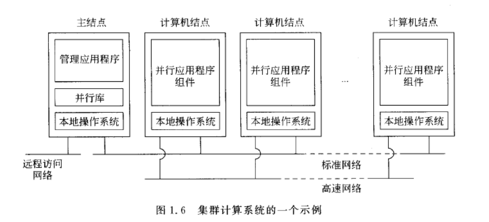

  * 网格计算系统

    > 具有高度的异构性：硬件，操作系统，网络，管理域和安全策略都不尽相同

    * 解决异构性的方式：虚拟组织
    * 光纤层：在特定站点提供对局部资源的接口
    * 连接层：由通信协议组成，用于支持网格事务处理
    * 资源层：负责管理单个资源
    * 汇集层：负责处理对多个资源的访问
    * 应用层：由应用程序组成，在虚拟组织中运行

    

* 分布式信息系统

* 分布式普适系统


## 体系结构

### 体系结构的样式

> 体系结构样式是根据组件，组件之间互相连接方式、组件之间的数据交换以及这些元素如何集成到一个系统中来定义的。

* 分层体系结构

* 基于对象的体系结构

  * 每个对象对应一个组件，组件通过远程过程调用机制来连接

  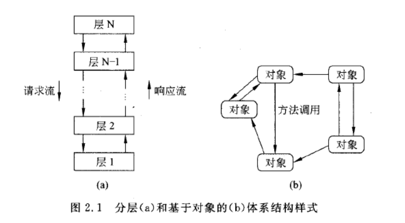

* 以数据为中心的体系结构

  * 进程通信需要通过一个公用仓库

* 基于事件的体系结构

  * 进程发布事件，中间件确保订阅了这些事件的进程接收它们。去耦合强。

  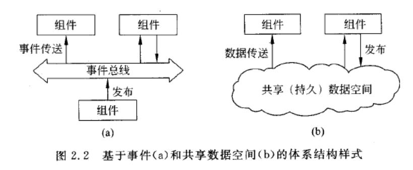

### 系统体系结构

* 集中式体系结构（客户—服务器）

  * 应用分层

    * 应用层：提供与用户交互的接口
    * 处理层：处理用户的请求，实现与数据的交互
    * 数据层：存储数据，如，文件系统，数据库

  * 多层体系结构

    * 两层体系结构：客户机和服务器
      * 根据将客户机和服务器实现的不同功能可以分为以下5种，d和e较为普遍

    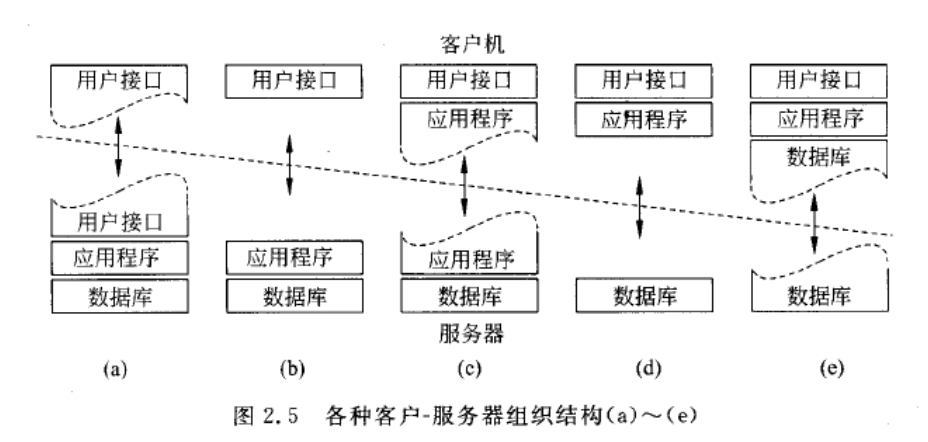

    * 三层体系结构：用户接口、应用程序服务器、数据库服务器

      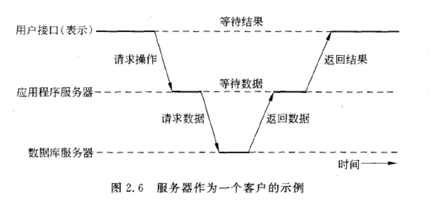

* 非集中式体系结构（回头听一听课）点对点

  垂直分布性（分层）：按逻辑把不同组件放在不同机器上

  水平分布性：客户和服务器可能在物理上被分割成逻辑上相等的几个部分，但每个部分都操作在整个数据集中自己共享的部分，从而实现负载均衡。例如点对点系统

  * 结构化的点对点体系结构

    * Chord系统分布式哈希表（后面章节）理解加入和退出

    

    * CAN：上下文可编制网络（后面章节）

  * 非结构化点对点体系结构

    > 主要依靠随机化算法来构造覆盖网络，每个节点维护一个邻接点列表，列表由随机的方法来构造。使用泛洪法来查找。

  * 覆盖网络的拓扑管理

  * 超级对等体

* 混合体系结构

  > 特殊的分布式系统，将客户服务器体系结构和非集中式体系结构组合在一起

  * 边界服务器系统

  * 协作分布式系统

    * 文件共享系统

      > 是一种点对点的文件下载系统，一个用户从其他用户下载文件块，知道所下载的文件块能够组装成完整的文件。一旦结点确定了从哪里可以下载文件块，下载结点将被强制为其他节点提供帮助。瓶颈期在于跟踪器。

    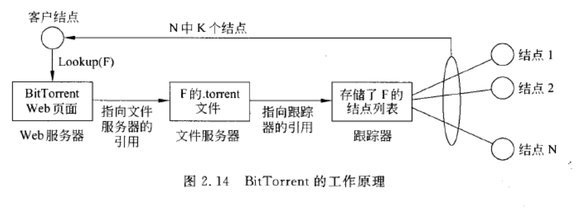

    * 协作内容分布式网络Globule

### 体系结构与中间件

> 中间件具有一定程度的透明性，一定程度上向应用程序隐藏了数据处理和控制的分布性

* 中断器

  > 是一种软件结构，能中断正常的控制流，从而允许其他代码运行。

  * 请求级中断器：为每个副本调用invoke函数
  * 消息级中断器：协助把消息传递接口激活转移给目标对象

* 自适应软件常见方法（基本技术）

  * 要点分离
  * 计算映像：程序检查自己
  * 基于组件的设计：通过组件的不同组合来支持自适应

### 分布式系统的自我管理

> 以高级反馈控制系统的形式来组织分布式系统，允许自动自适应变化。称为自治计算或自主系统。

自适应的多样性：自我管理、自我恢复、自我配置、自我优化

* 反馈控制模型：通过反馈控制循环实现

  * 形成反馈控制循环的三个元素
    * 系统本身需要被监视：对系统的各个方面进行测量（尺度预测组件）
    * 分析上述测量值：控制循环的核心部分，包含决定自适应的算法（反馈分析组件）
    * 其他组件

  


## 进程

### 线程

> 就粒度而言，将每个进程细分为若干控制线程的形式更加合适，可以使构建分布式应用程序变得更加方便，并可获得更好的性能。

* 线程简介

  > 线程上下文中一般值包含CPU上下文以及某些其他线程管理信息。

  * 非分布式系统中线程用法，好处

    * 多线程的系统中，线程阻塞不会造成进程阻塞
    * 在多处理系统上执行多线程程序时，可以使用并行操作技术
    * 线程之间的上下文切换小

  * 线程的实现

    > 一般以线程包的形式提供，这种包中含有创建和销毁线程的操作。分为用户及线程和内核级线程。

    * 用户级线程的好处
      * 创建和销毁线程开销小
      * 可以通过为数不多的几条指令实现线程上下文切换
    * 用户及线程的缺陷
      * 对引起阻塞的系统调用的调用将会立即阻塞该线程所属的整个进程
    * 轻量级进程：使用用户及线程和内核级线程的混合形式

* 分布式系统中的线程

  * 多线程客户

    > 隐藏通信事件延迟的方法：启动通信后立即进行其他工作

    * web浏览器显示HTML页面

  * 多线程服务器

    * 能够保留顺序处理的思路，使用阻塞性的系统调用，并且仍能够达到并行处理的目的

    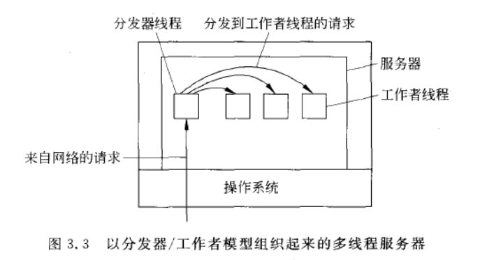

    分发器线程：读取文件操作请求

    工作者线程：处理请求

### 虚拟化

> 虚拟化的本质是拓展或替换一个现存界面来模仿另一个系统的行为。

* 虚拟化在分布式系统中的作用

  * 旧有软件的维护，跟不上下层平台更新的步伐，硬件更新速度太快，需要软件兼容。通过移植旧有软件的底层接口到新平台，虚拟化可以帮助解决这个问题
  * 虚拟化便于减少服务器和硬件机器的种类和数目，提供了高度的移植性和灵活性

* 虚拟机体系结构

  ```
  在四个不同层次提供四个不同界面
  由机器指令组成，可由任何程序激起的硬件软件界面
  由机器指令组成，只有特权程序才可激起的硬件软件界面
  由操作系统提供的系统调用（system call）组成的界面
  由库调用组成的界面，通常形成了所谓的应用程序编程接口（API）
  ```

  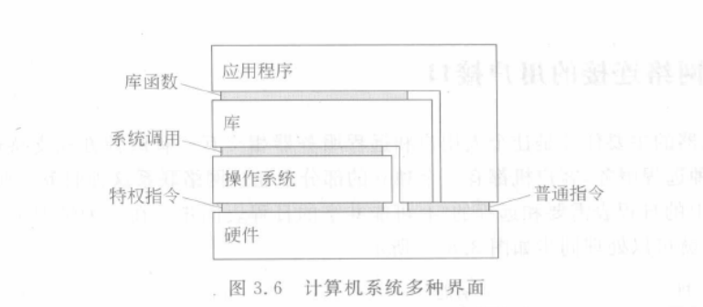

  

  * 虚拟化的两种方式

    

    * 构建一个运行时的系统，提供一套抽象指令集来执行程序（进程虚拟机）
    * 提供一种系统，如VMware（虚拟机监视器）

### 客户端

* 客户端软件与分布式透明性

  > 理论上来说，客户端不应该察觉到它与远程进程的通信，而服务器来说，分布常常不那么透明

  * 许多分布式系统利用客户端解决方案来实现复制透明性

    * 调用请求转发给每一个服务器发送副本来达到复制透明性

    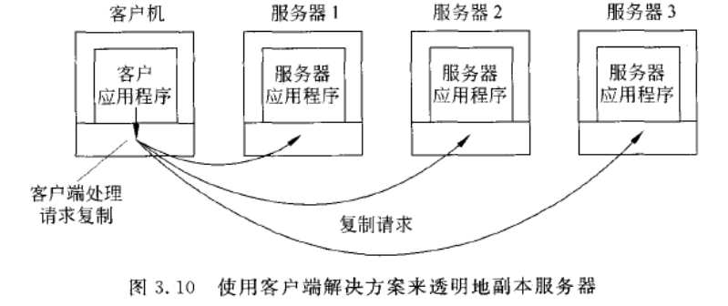

  * 故障透明性，一般是通过客户中间件完成

### 服务器

* 常见的设计问题

  > 服务器的组织方式：等待来自客户的请求，随后负责处理该请求，等待下一个请求

  服务器的不同组织结构

  * 迭代服务器：自己处理请求，并且在必要的情况下将响应返回给发出请求的客户

  * 并发服务器：并不自己处理请求，而是将请求传递给某个独立线程或其他进程来处理，只用于等待请求。如：多线程服务器。

  * 超级服务器：用于负责监听所有与服务关联的端口，缓解了每一个服务器都要对端口监听的浪费。

    

  * 状态无关服务器：不保存客户的状态信息且不将自身状态告知客户

    * 好处
      * 不需要采取任何特殊措施来使得奔溃的服务器恢复，重启即可

  * 状态相关服务器：一直保存客户端的信息直到显式的删除

    * 好处：
      * 性能能够提升
    * 缺陷：
      * 如果服务器崩溃，就必须恢复客户端的状态表

* 服务器集群

  > 服务器集群式一组经网络连接的机器，每台机器运行一个或多个服务器

  * 常见的组织

    * 多数情况下逻辑上由三层组成

      

      * （逻辑上的）交换机：分配客户请求给服务器

        * 作为服务器集群的入口，提供唯一的网络地址

        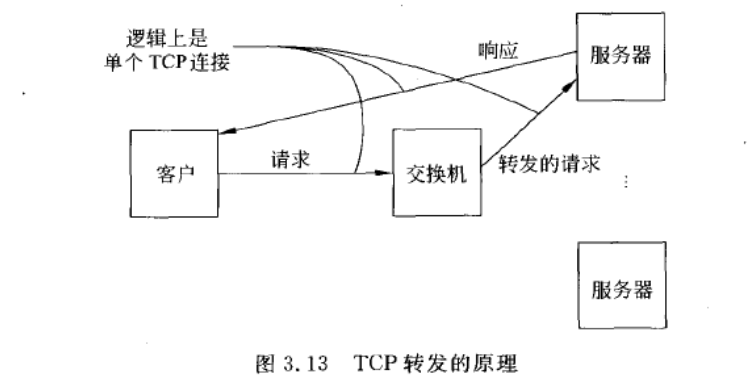

        * 交换机收到tcp连接请求，将请求分发给最佳服务器，服务器发送应答信号，并嵌入交换器的IP

      * 专用的应用/计算处理服务器：提供高性能计算能力

      * 文件和数据库服务器（数据存取是瓶颈）

  * 分布式服务器

    > 分布式服务器是指可动态变化的集群，它的访问点也可以变化，但对外却表现为一台强有力的单台机器。

    * 基本思想：可靠、高性能、稳定
    * 如何实现一个稳定访问点
      * 使用宿主代理（宿主网络的特别的路由器）

* 管理服务器集群的方法

  * 通用方法
    * 把传统的单台计算机管理功能拓展到服务器集群，从远程客户登录到集群的一个节点并执行本地管理命令

### 代码迁移

> 传递程序，甚至传递正在执行中的程序。

* 代码迁移方案

  > 代码迁移是以进程迁移的形式进行的，代码迁移会带来巨大的开销

  * 进行代码迁移的好处

    * 如果把进程由负载较重的机器上转移负载较轻的机器上，能提升系统的整体性能
    * 灵活性，如果代码可以在不同的机器之间移动，就可以动态的配置分布式系统

  * 代码迁移模型

    进程包含3段：代码段（包含正在运行程序的所有指令），资源段（包含外部资源的指针），执行段（存储进程当前状态）

    * 弱可移动性：只传输代码段以及初始化数据
      * 传输的程序总是从预先定义的位置开始执行。较简单
    * 强可移动性：可以传输执行段
      * 可以先停止运行中的进程，然后将它移到另一台机器上去，再从中断的位置继续执行

    另一种分类方式

    * 发送者启动迁移：由正在执行该代码的机器启动迁移
    * 接收者启动迁移：代码迁移主动权掌握在目标机器手里

    

## 通信

> 四个广泛使用的通信模型：远程过程调用（RPC，remote procedure call）、远程方法调用（RMI，remote method invocation）、面向消息的中间件（MOM，message-oriented middleware）、流（stream）

> RPC的目的在于将消息传递的大部分复杂性隐藏起来，比较适合客户-服务器应用程序。

* 基础知识

  * 分层协议
    * OSI七层模型：略
    * 中间件协议：中间件是一种应用程序，位于应用层中
  * 通信类型
    * 持久通信：提交传输的消息一直由通信中间件存储，直到消息被传送给接收方
    * 瞬时通信：通信系统只有在发送和接受应用程序正在运行时才能存储消息
    * 异步通信（asynchronous）：发送方在提交要传输的消息后立即往下进行
    * 同步通信（synchronous）：发送方将被阻塞，直到其请求被接受

* 远程过程调用

  > 当机器A上的进程调用机器B上的进程是，A上的调用进程被挂起，而B上的被调用的进程开始执行，调用方可以通过使用参数将信息传给被调用放，然后通过传回的结果得到信息。编程人员看不到任何消息传递过程，这种方法称为远程过程调用

  复杂性：地址空间不同、参数和结果的传递、机器如果发生崩溃

  * 基本的RPC操作

## 命名系统 - Naming

> 命名是在分布式中表示这个实体，且要访问到这个实体。

- 访问点：用来实体的一种特殊实体。
- 地址：访问点的名称。

所以**访问点**就是实体的**地址**。

### DHT

全称是Distributed Hash Tables，是P2P环境下最经典的解决方案

### Chord

使用一个m位的标识符空间，把**随机选择**的标识符赋给结点，并把键值赋值给特定实体（任意的东西，比如文件、进程）。

**构造Finger table算法：**

每个Chord结点维护一个最多有m个实体的指状表(Finger table)，如果用$FT_p[i]$表示结点$p$的指状表，那么有：
$$
FT_p[i] = succ(p+2^{(i-1)})
$$


$-p$是当前结点$-i$是指状表的$index-succ(k)$表示k（若结点k存在）或k的下一个**存在**的结点，即$succ(k)>=k$

例：

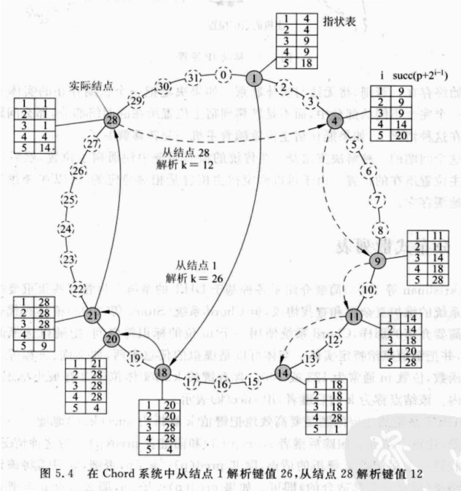

根据$FT_p[i] = succ(p+2^{(i-1)})$公式，构造结点p=4的Finger table：

|  i   |   $FT_p[i]$   |
| :--: | :-----------: |
|  1   |  succ(4+1)=9  |
|  2   |  succ(4+2)=9  |
|  3   |  succ(4+4)=9  |
|  4   | succ(4+8)=14  |
|  5   | succ(4+16)=20 |

**解析算法：**

目标：从节点p开始解析key=k的结点

搜索节点p的Finger table，从上依次向下搜索，如果一个结点q满足：
$$
q=FT_p[j]<=k<FT_p[j+1]
$$


那么就将该请求转发给结点q；

如果p的Finger table第一个结点就比k还大，即：
$$
p<k<FT_p[1]
$$


那么就转发给$FT_p[1]$结点，此节点负责结点k，将k的地址返回给结点p。

**例：**

还是上面那个图

从结点1开始解析k=26：

1. 结点1的指状表里，$FT_1[5]$=18≤26，将请求转发给18；
2. 结点18的指状表里，$FT_{18}[2]$=20≤26<$FT_{18}[3]$=28，将请求转发给20；
3. 结点20的指状表里，$FT_{20}[1]$=21≤26<$FT_{20}[2]$=28，将请求转发给21；
4. 结点21的指状表里，21<26<$FT_{21}[1]$=28，将请求转发给28，该结点负责解析k=26；

从结点28开始解析k=12：

1. 结点28的指状表里，$FT_{28}[4]$=4≤12<$FT_{28}[5]$=14，将请求转发给4；
2. 结点4的指状表里，$FT_{4}[4]$=9≤12<$FT_{4}[4]$=14，将请求转发给9；
3. 结点9的指状表里，$FT_{9}[2]$=11≤12<$FT_{9}[3]$=14，将请求转发给11；
4. 结点11的指状表里，11<12<$FT_{11}[1]$=14，将请求转发给14，该结点负责解析k=12；

### HLS

网络被划分为一组域。每个域D都有关联的目录节点dir(D)，dir(D)会跟踪域中的实体，形成一颗目录结点树。

### HLS结构

看下面这个图来解释一下HLS吧：

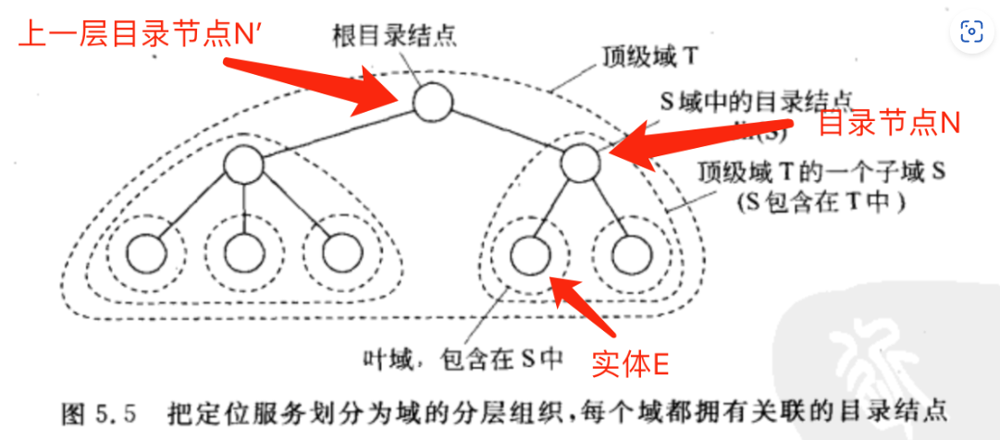

为了跟踪实体E的位置，实体E位于域S中，所以域S的目录结点N含有E在该域中的位置信息。

而在比域S更高一级的域T中，域T的目录结点N'也有实体E的位置信息，但是这个位置信息只有N的指针，也就是要找实体E，就先去找到其子域的目录结点N，然后通过目录节点N找到E。

同理，在比域T更大的域中，那个域的目录节点也有实体E的位置信息，不过这个位置信息只有N'的指针，要找实体E，就要先找N'，然后找到N，最后找到E。

所以顶级域的目录结点，即根（目录）节点，包括全部实体位置信息。

### 如果一个实体有多个地址

实体可以拥有多个地址，比如被复制了，实体在域D1和域D2中都有地址，那么同时包含D1和D2的最小域目录结点将有两个指针，每个指针都指向一个包含地址的子域。

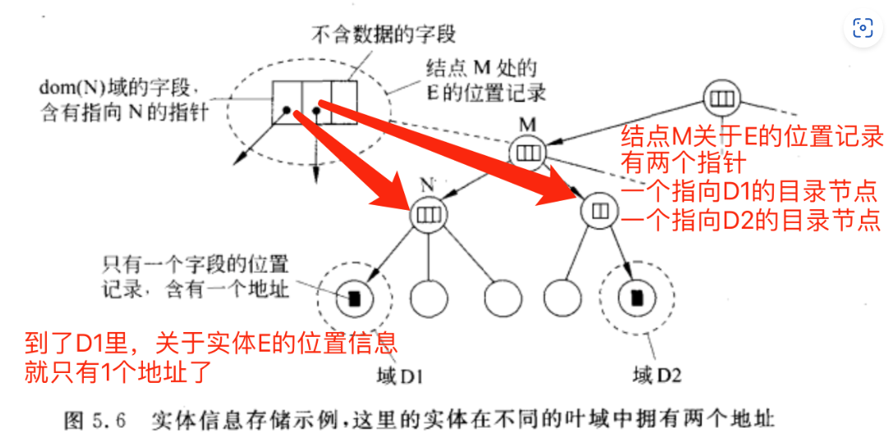

### HLS查询操作

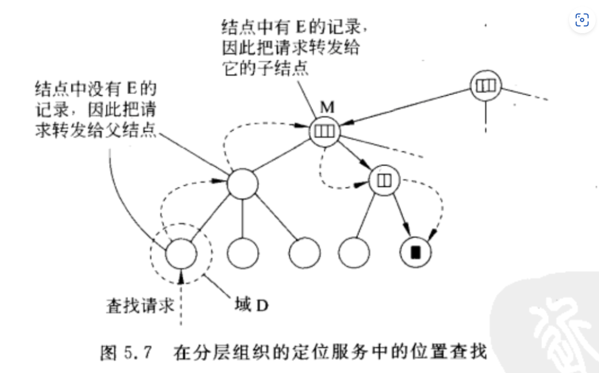

现在希望能定位实体E的位置信息，那么就向当前域的目录结点发送查找请求：

```
if 目录结点找到了实体E的位置信息:
	if 找到的是子域目录结点的地址
		把查找请求转发给子域的目录结点
	else 
		找到了叶节点，把地址返回给请求的客户
else
	把查找请求转发给父节点
```

最差情况是一直找不到，向上转发直到根节点。