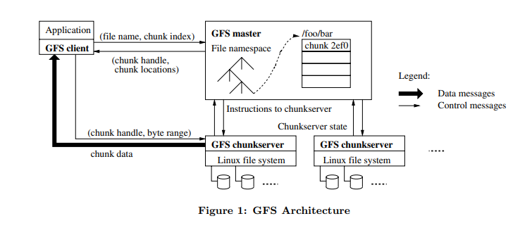
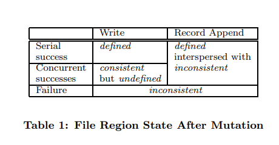
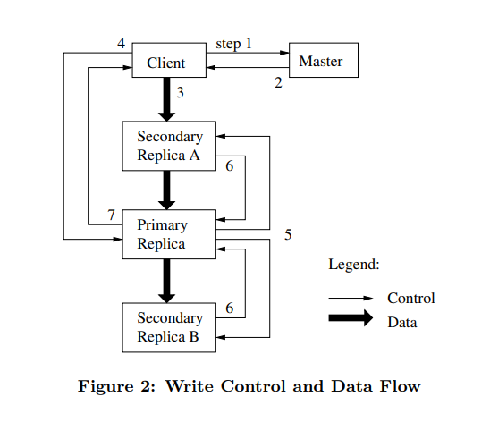

# 分布式存储系统的目标

通常我们设计大型分布式系统或者大型存储系统的出发点是，我们需要获得巨大的**性能加成**，进而利用数百台计算机的资源来同时完成大量工作。之后很自然的想法便是将数据分割放到大量的服务器上，这样就可以并行的从多台服务器读取数据。这种方式称之为分片`Sharding`。

而当我们在成百上千台服务器进行分片，量多了便会出现一些常态的故障。如果我们有数千台服务器，每台服务器平均每三年故障一次，那么我们平均每天就会有3台服务器宕机。所以我们需要自动化的方法而不是人工介入来修复错误，我们需要一个自动容错系统，这便是**容错**。

实现容错最有用的方式便是复制，我们可以通过维护多个数据的副本，当其中一个故障了以后，变使用另一个。因此想要拥有容错能力，就要有**复制**。

而很显然，我们是会把同样的数据放在不同的服务器上，也就是说同一份数据会拥有多个副本，有多个副本就有可能因为并发的原因导致不同副本的不一致，也许我们可以通过一些手段去实现**一致性**，让我们的结果符合是基于其，但是这样的效果，往往伴随着性能的降低，而这便回到了我们开始的性能问题。

# 论文-GFS（Google File System）

> 论文链接:[https://pdos.csail.mit.edu/6.824/papers/vm-ft.pdf](https://pdos.csail.mit.edu/6.824/papers/vm-ft.pdf)

`Google`文件系统是一个用于大型分布式数据密集型应用程序的可拓展分布式文件系统。分布式文件系统是一种文件系统架构，用于在网络中多个服务器和存储设备之间共享文件和数据。主要目标是允许用户远程访问存储在多个不同地理位置的服务器上的数据，就像这些文件存储在本地计算机上一样。分布式文件系统支持文件的存储和管理，使得文件能够跨多个物理存储设备分散存储，同时为用户提供统一连贯的访问接口。所追求的目标在于性能、可拓展性、可靠性、可用性。

`GFS`提供一些熟悉的文件系统接口，文件在目录中层次化组织，并由路径名进行标识，包括支持创建、删除、打开、关闭、读取和写入文件的常规操作。

`GFS`还有快照和记录追加操作，快照以低成本创建文件或者目录树的副本，记录追加允许多个客户端同时向同一个文件追加数据，同时保证每个客户端追加的原子性，许多客户端可以同时追加数据而无需额外的锁定。

## 架构

`GFS`集群由一个主控和多个块服务器组成，并由多个客户端访问，集群中的节点通常是运行用户级服务器进程的普通`linux`机器。文件被分割成固定大小的块，每个块由`master`在块创建时分配的不可变且全局唯一的64位块句柄标识。块服务器将块存储在本地磁盘上作为`linux`文件，并按块句柄和字节范围读取或者写入块数据。通常为了可靠性，会保存多个副本。

`master`维护所有文件系统元数据。这包括命名空间、访问控制信息、从文件到块的映射以及块的当前位置信息。它还控制系统范围的活动，如块租约管理、孤立块的垃圾回收和块服务器之间的块迁移。`master`定期通过心跳消息与每个块服务器通信，向其发送指令并收集其状态。

链接到每个应用程序的`GFS`客户端代码实现文件系统`API`，并与`master`和块服务器通信以代表应用程序读写数据。客户端与`master`交互以进行元数据操作，但所有数据承载的通信都直接与块服务器进行。

假设我们一个客户端想要读取`GFS`中的内容，首先会使用固定的块大小，将应用程序指定的文件名和字节偏移量转化为文件中的块索引，然后向`master`发送包含文件名和块索引的请求，`master`会恢复相应的句柄和副本的位置。客户端随后便会向其中的一个副本发送请求，通常时最近的副本。请求指定块句柄和该块内的字节范围。进一步读取相同块不需要更多的客户端-主控交互，直到缓存信息过期或文件重新打开。

## 块大小

在`GFS`中采用了`64MB`作为文件系统中的块大小，这实际上是一个比较打的文件系统块，很显然，我们的数据是存储在块服务器上的，如果我们仅仅是需要写入或者访问小文件的话，那么块内会存在比较大的内部碎片。

当然论文中也给出了使用大块的优势：首先，它减少了客户端与主控交互的需求，因为对同一块的读取和写入只需要一次向主控请求块位置信息。对于工作负载，这种减少尤其显著，因为应用程序主要顺序读取和写入大文件。即使对于小的随机读取，客户端也可以舒适地缓存多`TB`工作集的所有块位置信息。其次，由于在一个大块上，客户端更有可能在给定块上执行许多操作，它可以通过在一段时间内保持与块服务器的持久`TCP`连接来减少网络开销。第三，它减少了主控存储的元数据量。这允许我们将元数据保存在内存中，在内存中运行速度其实就会快很多。

## 元数据

主控master存储三种主要类型的元数据：

文件和块chunck命名空间，类似于会拥有一个类似于所有文件名和所有块命名空间的`set`

从文件到块的映射，这个表单会告诉我们，文件对应了哪些块。

以及每个块的副本的位置，这个表单记录了从块ID到块数据的对应关系，会包含每个块存储在哪些服务器上，每个块当前的版本号。

所有的元数据保存在主控内存中。前两种类型的数据会将变更以`log`的形式记录在磁盘上，并在远程机器上复制来保持持久性。而第三种类型的数据则会在启动时或者每次块服务器加入集群时向每个块服务器请求这些信息。这样能够减少主控持久存储的复杂性，并且块服务器可以通过定期的心跳消息，动态报告其持有的块信息。另一个原因便是，块服务器对自身磁盘上的块拥有最终决定权，因为块服务器上的错误可能导致块自发的消失（比如磁盘损坏、被禁用等），所以主控保持这个信息的一致视图没有任何意义。

## 一致性模型

> `GFS`具有松散的一致性，也就是弱一致性，旨在在性能、可用性和一致性之间找到一个平衡点，和强一致性模型相比起来，松散的一致性模型允许不同结点在某些时间点上对数据的看法有所不同，从而提高系统的可拓展性和容错性。

**数据变更**

文件命名空间的变更（例如，文件创建）是原子的。它们完全由主控处理：命名空间锁定保证原子性和正确性；主控的操作日志定义了这些操作的全局总顺序。

而文件区域在数据变更后的状态则取决于变更类型、是否成功以及是否存在并发变更。

文件区域在数据变更后的状态可以分为以下几种情况：

1、一致（Consistent）：

* 定义的（Defined）：如果文件数据变更后，所有客户端无论从哪个副本读取数据都能看到相同的数据，并且该数据是变更完全写入的数据，那么该文件区域是定义的。这种情况通常发生在没有并发写入者干扰且变更成功时。
    
* 未定义（Undefined）：如果多个客户端同时成功进行变更，尽管所有客户端看到的数据是一致的，但数据可能是多个变更的混合片段，不一定反映任何一个变更写入的数据。这种情况下，文件区域是未定义的，但仍然是一致的。

2、不一致（Inconsistent）：

* 未定义（Undefined）：如果变更失败，不同客户端可能在不同时间看到不同的数据，这种情况下，文件区域是不一致的，同时也是未定义的。

应用程序通常要对未定义的区域进行一定的逻辑处理来确保数据的完整性。

# 系统交互

> 论文呢第三章描述了客户端、主控和块服务器如何交互以实现数据变更、原子记录追加和快照等相关功能。

## 租约和变更数据

变更是改变块内内容或元数据的操作，如写入或追加操作。每个变更在所有块副本上执行，`GFS`中使用租约来维护副本间一致的变更顺序。`master`将块租约授予一个副本，这个副本称为主要副本。主要副本为块的所有变更选择一个顺序，所有副本在应用变更时遵循此顺序，因此，全局变更顺序首先由主控选择的租约授予顺序定义，并且在租约内由主要副本分配的序列号定义。

这样的目的在于最小化主控的管理开销。租约的初始超时时间为60秒，然而，只要块正在变更，主要副本可以请求无限期的拓展，这些拓展请求和授予被附加在与主控的所有块服务器定期交换的心跳消息中。

文件写入的控制流大致如下

1、客户端询问主控哪个块服务器持有块的当前租约以及其他副本的位置。如果没有持有租约的块服务器，主控将授予一个。

2、主控回复主要副本的身份和其他（次要）副本的位置。客户端将此数据缓存以用于未来的变更。只有在主要副本不可达或回复不再持有租约时，才需要再次联系主控。

3、客户端将数据推送到所有副本。客户端可以以任何顺序执行此操作。每个块服务器将数据存储在内部LRU缓冲区缓存中，直到数据被使用或老化出缓存。通过将数据流与控制流分离，我们可以根据网络拓扑调度昂贵的数据流，从而提高性能，而不考虑哪个块服务器是主要副本。

4、一旦所有副本确认接收数据，客户端将写入请求发送到主要副本。请求标识先前推送到所有副本的数据。主要副本为它接收到的所有变更（可能来自多个客户端）分配连续的序列号，提供必要的序列化。它按序列号顺序将变更应用于本地状态。

5、主要副本将写入请求转发给所有次要副本。每个次要副本按主要副本分配的相同序列号顺序应用变更。

6、所有次要副本回复主要副本，表明它们已完成操作。

7、主要副本回复客户端。任何副本遇到的错误都会报告给客户端。如果发生错误，写入可能在主要副本和次要副本的任意子集上成功。（如果在主要副本上失败，则不会分配序列号并转发。）客户端请求被视为失败，修改区域处于不一致状态。我们的客户端代码通过重试失败的变更来处理此类错误。在回退到从写入开始重试之前，会尝试步骤（3）到（7）几次。

我们可以看出来这里在写入数据的时候，是把数据流和控制流分离开的，数据流从客户端到所有的副本，而控制流（写入请求）只从客户端到主要副本。可其他副本的写入请求和写入顺序则是由主要副本来完成控制。这样可以充分利用每台机器的网络带宽，尽可能避免网络延迟。

`GFS`提供称为记录追加的原子追加操作，记录追加是一种变更，客户端将数据推送到文件最后一个块的所有副本。然后，它将请求发送到主要副本。主要副本检查将记录追加到当前块是否会导致块超过最大大小（64MB）。如果是，它会将块填充到最大大小，告诉次要副本也这样做，并回复客户端指示操作应在下一个块上重试。（记录追加被限制在最大块大小的四分之一以内，以保持最坏情况的碎片在可接受的水平。）如果记录适合最大大小（这是常见情况），主要副本将数据追加到其副本，告诉次要副本在相同偏移处写入数据，然后向客户端回复成功。

**快照**

快照操作几乎瞬间制作文件或目录树（“源”）的副本，同时最小化对正在进行的变更的中断。用户使用它来快速创建巨大数据集的分支副本（通常递归地复制这些副本），或者在进行更改实验之前检查当前状态，这些更改可以轻松提交或回滚。

使用标准的写时复制技术来实现快照。当主控接收到快照请求时，它首先撤销关于快照文件所有块的块服务器租约。这确保了对这些块的任何后续写入都需要与主控交互以找到租约持有者。这将给主控一个机会首先创建块的新副本。

在租约被撤销或过期后，主控将操作记录到磁盘。然后，它通过复制源文件或目录树的元数据将此日志记录应用到其内存状态。新创建的快照文件指向与源文件相同的块。

