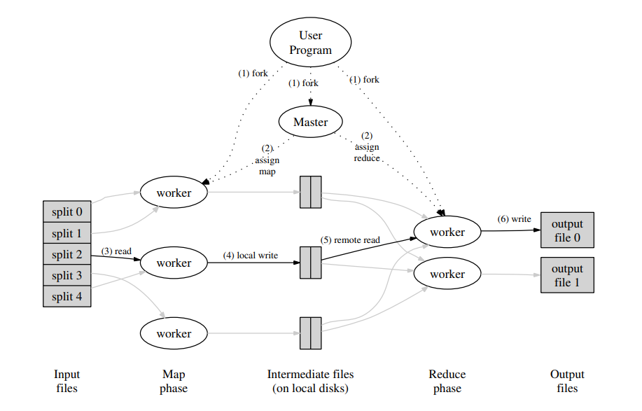
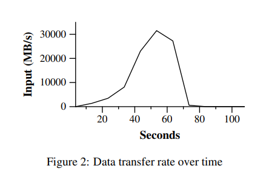

# 论文-MapReduce

> [论文链接](https://pdos.csail.mit.edu/6.824/papers/mapreduce.pdf)

`MapReduce`是一种编程模型，用于处理和生成大规模数据集，用户指定一个`map`函数，该函数处理一组输入数据（键值对）以生成一组中间键/值对，并指定一个`reduce`函数来合并所有与同一个键相关的中间值。

以这种函数式风格编写的程序会自动并行化，并在大规模集群的商品机器上执行。运行时系统负责分割输入数据、在一组机器上调度程序的执行、处理机器故障以及管理必要的机器间通信。这使得没有并行和分布式系统经验的程序员也能轻松利用大型分布式系统的资源。

我们可以理解为`MapReduce`隐藏了在一组机器运行过程中进行通信的细节，当然还有并行化、容错、数据分发和负载平衡的复杂细节，使得程序员可以和开发普通程序一样开发分布式的应用。

# 例子-词频统计

```C++
#include "mapreduce/mapreduce.h"

// 用户定义的map函数
class WordCounter : public Mapper {
public:
    virtual void Map(const MapInput& input) {
        const string& text = input.value();
        const int n = text.size();
        for (int i = 0; i < n; ) {
            // 跳过前导空白字符
            while ((i < n) && isspace(text[i]))
                i++;

            // 找到单词的结尾
            int start = i;
            while ((i < n) && !isspace(text[i]))
                i++;

            if (start < i)
                Emit(text.substr(start, i - start), "1");
        }
    }
};
REGISTER_MAPPER(WordCounter);

// 用户定义的reduce函数
class Adder : public Reducer {
    virtual void Reduce(ReduceInput* input) {
        // 遍历具有相同键的所有条目并累加值
        int64 value = 0;
        while (!input->done()) {
            value += StringToInt(input->value());
            input->NextValue();
        }

        // 为 input->key() 发出累加结果
        Emit(IntToString(value));
    }
};
REGISTER_REDUCER(Adder);

int main(int argc, char** argv) {
    ParseCommandLineFlags(argc, argv);

    MapReduceSpecification spec;

    // 将输入文件列表存储到 "spec" 中
    for (int i = 1; i < argc; i++) {
        MapReduceInput* input = spec.add_input();
        input->set_format("text");
        input->set_filepattern(argv[i]);
        input->set_mapper_class("WordCounter");
    }

    // 指定输出文件
    MapReduceOutput* out = spec.output();
    out->set_filebase("/gfs/test/freq");
    out->set_num_tasks(100);
    out->set_format("text");
    out->set_reducer_class("Adder");

    // 可选：在map任务中进行部分累加以节省网络带宽
    out->set_combiner_class("Adder");

    // 调整参数：最多使用2000台机器，每个任务使用100 MB内存
    spec.set_machines(2000);
    spec.set_map_megabytes(100);
    spec.set_reduce_megabytes(100);

    // 现在运行它
    MapReduceResult result;
    if (!MapReduce(spec, &result)) abort();

    // 完成：'result' 结构包含关于计数器、耗时、使用的机器数量等信息

    return 0;
}
```

`map`函数发出每个单词及其相关的出现次数（示例中为“1”）。`reduce`函数将所有为特定单词发出的计数相加。

我们还可以编写代码以填写`mapreduce`规范对象，指定输入和输出文件的名称以及可选的调整参数。然后调用`MapReduce`函数，传递该规范对象。用户的代码与`MapReduce`库（用C++实现）链接在一起。附录A包含此示例的完整程序文本。

事实上`MapReduce`在很多能够拆分成小任务的一些需求中都能够得到很好的应用，`URL`访问频率统计、倒排索引等。

* 分布式`Grep`：`map`函数在匹配提供的模式时发出一行。`reduce`函数是一个标识函数，它只是将提供的中间数据复制到输出中。

* `URL`访问频率统计：`map`函数处理网页请求日志并输出〈`URL`，1〉。`reduce`函数将同一`URL`的所有值相加并发出〈`URL`，总计数〉对。

* 倒排索引：`map`函数解析每个文档，并发出〈词，文档ID〉对序列。`reduce`函数接受给定词的所有对，排序相应的文档ID并发出〈词，文档ID列表〉对。所有输出对的集合形成一个简单的倒排索引。很容易扩展此计算以跟踪词的位置。

# MapReduce的整体执行流程

当用户程序调用`MapReduce`函数时，会发生以下的一系列操作（图中的编号对应这列表的序号）

1、用户程序中的`MapReduce`库首先将输入文件分割成`M`个部分，每个部分通常为`16MB`到`64MB`（用户可以通过一个可选参数来控制）。然后它在集群中的许多机器上启动该程序的多个副本。

2、程序的一个副本是特殊的——**主控Master**。其余的是**工作节点Worker**，由主控分配任务。主控有`M`个`map`任务和`R`个`reduce`任务要分配。主控选择空闲的工作节点并分配给它们`map`任务或`reduce`任务。

3、被分配`map`任务的工作节点读取相应输入分割的内容。从输入数据解析出键/值对，并将每个对传递给用户定义的`Map`函数。`Map`函数生成的中间键/值对缓存在内存中。

4、定期地，这些缓冲对被写入本地磁盘，并由分区函数分成`R`个区域。这些缓冲对在本地磁盘上的位置传递回主控，主控负责将这些位置转发给`reduce`工作节点。

5、当主控通知`reduce`工作节点这些位置时，它使用远程过程调用从`map`工作节点的本地磁盘读取缓冲数据。当`reduce`工作节点读取了所有中间数据后，它按中间键排序，以便将相同键的所有出现都分组在一起。由于通常许多不同的键映射到同一个`reduce`任务，排序是必要的。如果中间数据量太大而无法放入内存，则使用外部排序。

6、`reduce`工作节点迭代排序后的中间数据，并且对于遇到的每个唯一中间键，它将该键及其对应的中间值集合传递给用户的`Reduce`函数。`Reduce`函数的输出被附加到该`reduce`分区的最终输出文件中。

7、当所有`map`任务和`reduce`任务完成时，主控唤醒用户程序。此时，用户程序中的`MapReduce`调用返回。

完成后，`mapreduce`执行的输出在`R`个输出文件中可用（每个`reduce`任务一个输出文件，文件名由用户指定）。通常，用户不需要将这些`R`个输出文件合并成一个文件——他们通常将这些文件作为另一个`MapReduce`调用的输入，或使用能够处理分区输入的其他分布式应用程序。



`Master`会保存多个数据结构，对于每一个`map`任务和`reduce`任务，它的存储状态（空闲、进行中或完成）和工作节点的身份等。同时也是中间文件区域的位置从`map`任务传播到`reduce`任务的中介，对于每一个完成的`map`任务，`Master`存储这它生成的`R`个中间文件区域的位置和大小，完成以后会将信息传递给`reduce`。

# 容错

> 主要讨论当节点出现故障以后，会进行怎样的后续处理，保证容错

## 工作节点故障

`Master`会定期`ping`每个工作节点。如果在一定时间内没有收到工作节点的响应，主节点会将该工作节点标记为故障，该工作节点完成的任何`map`任务都被重置为初始空闲状态，因此可以在其他工作节点上进行调度。同样进行中的`map`任务或者`reduce`任务也会被置为空闲。

完成的`map`任务在故障发生时重新执行，因为它们的输出存储在故障机器的本地磁盘上，因此无法访问。例如：当`map`任务首先由工作节点`A`执行，然后由于`A`失败而由工作节点`B`重新执行时，所有执行`reduce`任务的工作节点都会被通知重新执行。任何尚未从工作节点`A`读取数据的`reduce`任务将从工作节点`B`读取数据。

完成的`reduce`任务不需要重新执行，因为它们的输出存储在全局文件系统中。

## 主节点故障

主节点会定期的写入当前主控数据结构的检查点，如果主节点任务失败，可以从最后一个检查点状态来启动新的副本。简单的来说，主节点会使用数据结构来维护当前工作节点的状态和任务状态，通过定期的将这些状态写入到文件中，就可以从最近一次写入的文件中恢复主节点。

在论文中还讲了语义的一致性，个人理解大致的意思就是，类似于多线程的操作，没有办法保证执行过程中的顺序，但是可以保持最终一致性，就是说我们在单台机器完成同样的任务和使用`MapReduce`在多台机器中完成任务在最终的表现上是一致的。

# 改进措施

论文中提出了一些能够使得`MapReduce`更加灵活和高效的改进措施。

* 分区函数

    由用户指定他们希望的`reduce任务/输出文件的数量`。通过中间键的分区函数将数据分区到这些任务中。提供默认的分区使用函数，使得分区保持平衡。分区的目的是让用户机器自己决定自己能够承载的任务数，而按键分区则是能够尽可能的确保同一个`key`保存在同一个输出文件中

* 有序处理

    保证在给定分区内，中间键/值对按键递增顺序处理。这种排序保证使每个分区生成排序的输出文件变得容易，当输出文件格式需要支持按键的高效随机访问查找时，或者用户发现按键排序的数据更方便时，这很有用

* 合并函数

    在每台机器执行完`map`任务以后，每一个`map`函数都会生成对应的输出文件，将这些发送给`reduce`之前，可以将执行的`map`任务完成后的输出进行合并，能够很好的提高效益

> 更多内容还是参考论文吧

在后续的章节中，论文中还给出了对于`Google`在实际应用当中对于某些任务处理的性能分析，例如：



图中展示的是分布式`grep`程序运行过程，`grep`程序扫描`1010`个`100`字节的记录，搜索一个相对稀有的三个字符的模式（该模式出现在92,337个记录中）。输入被分割成大约`64MB`的部分（`M` = 15000），所有输出放在一个文件中（`R` = 1）。

计算随时间的进展。`Y`轴显示扫描输入数据的速率。随着分配给该`MapReduce`计算的机器数量的增加，速率逐渐上升，当1764个工作节点被分配时达到`30GB/s`以上。当`map`任务完成时，速率开始下降并在计算开始后大约80秒时降为零。整个计算从开始到结束大约需要150秒。这包括大约一分钟的启动开销。开销是由于将程序传播到所有工作节点，以及与`GFS`交互以打开1000个输入文件集并获取本地性优化所需的信息而产生的。

文章是2004年发出的，考虑到当时的网络，`MapReduce`评估瓶颈主要在于当时的网络带宽的限制，所以感觉只会在必要的情况下进行不同机器之间的通信，而更多计算和依赖都会在本地完成，这样就能够降低网络带宽带来的影响，文章也提到了，网络带宽是一种稀缺资源。因此，我们系统中的许多优化目标是减少跨网络发送的数据量：本地性优化允许我们从本地磁盘读取数据，写入单个副本的中间数据到本地磁盘节省了网络带宽。挺牛的！