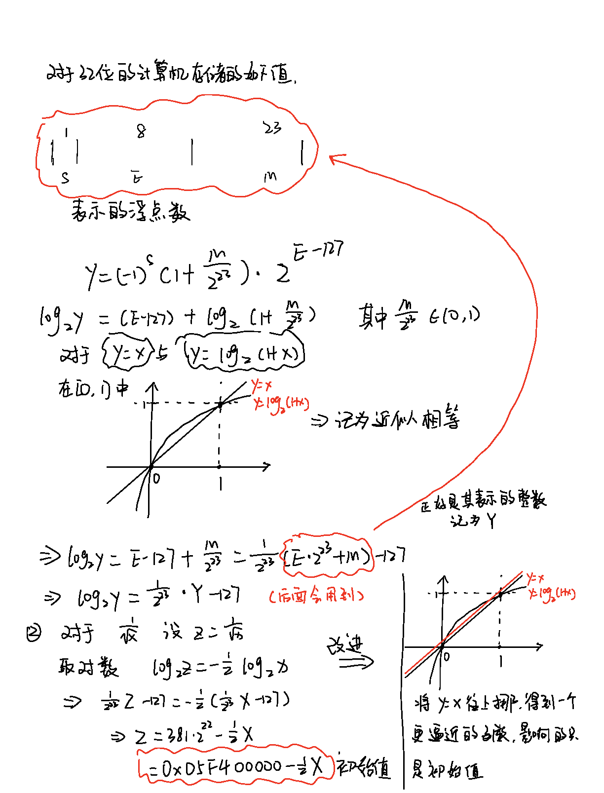

### 平方根倒数算法

$$
1/\sqrt{x}
$$

#### 求一个数的平方根倒数

对于计算机来说求一个数的平方根一般有两种方式，二分法和牛顿迭代法

* 二分法

  EXP表示精度，从0-num不断开始计算mid的平方，直到left>right，此时返回right的值即为所求的平方根，其中注意边界条件：

  当mid * mid = num时，此时left需要加上EXP，往后的循环中mid * mid 都会大于num，所以right还会不停减小，直到right < left，返回right，这时right已经在精度范围内

```c++
double Sqrt(double num) {
    double left = 0, right = num;
 
    while (left <= right) {
        double mid = left + (right - left) / 2;
 
        if (mid * mid <= num)
            left = mid + EXP;
        else
            right = mid - EXP;
    }   
 
    return right;
}
```

* 牛顿迭代法

  牛顿迭代法是将原来的求开方问题转化为数学函数问题，即假设`x * x = n`，求n的开方转化为`x * x - n = 0`的解，即`y = x * x - n`与x轴的交点

  代码中last表示上一次的切线与x轴的交点的x坐标，初始值为num，ret表示x = last时的切线与x轴的交点，不断迭代，直到ret - last小于精度，即达到精度返回ret。

```c++
double Sqrt(double num) {
    if (0 == num)
        return num;
 
    double last = num, ret = num;
 
    for (;;) {
        last = 0.5 * (ret + num / ret);
        if (fabs(ret - last) < EXP)
            break;
        ret = last;
    }   
 
    return ret;
}
```

计算完平方根过后，再计算其倒数，也是一个对计算机来说并不是很友好的运算

#### 快速平方根倒数计算推导

快速平方根算法是利用了计算机存储浮点数的特性并和牛顿迭代法来共同完成的，也是一个近似计算。对于牛顿迭代法，其精髓是如果能够找到一个接近于解的初始值，是有可能通过一次迭代或者较少次数的迭代达到比较高的近似解，而快速平方根算法旨在于找到一个较为近似的初始值。具体的运算如下。

**笔记中有一处笔误0xD5F400000应改成0x5F400000**



快速平方根算法代码

* 初始值由0x5F400000改为了0x5f3759df，对于X/2代码中使用了位运算加速求解

```C++
float Q_rsqrt(float number)
{
    long i;
    float x2, y;
    const float threehalfs = 1.5F;
    x2 = number * 0.5F;
    y = number;
    i = * ( long* ) &y;							// evil floating point bit hack
    i = 0x5f3759df - (i >> 1);					// what the fuck? 
    y = * ( float * ) &i;
    y = y * (threehalfs - ( x2 * y * y ) );		// 1st iteration
//  y = y * (threehalfs - ( x2 * y * y ) );		// 2st iteration, can be removed
    
    return y;
}
```